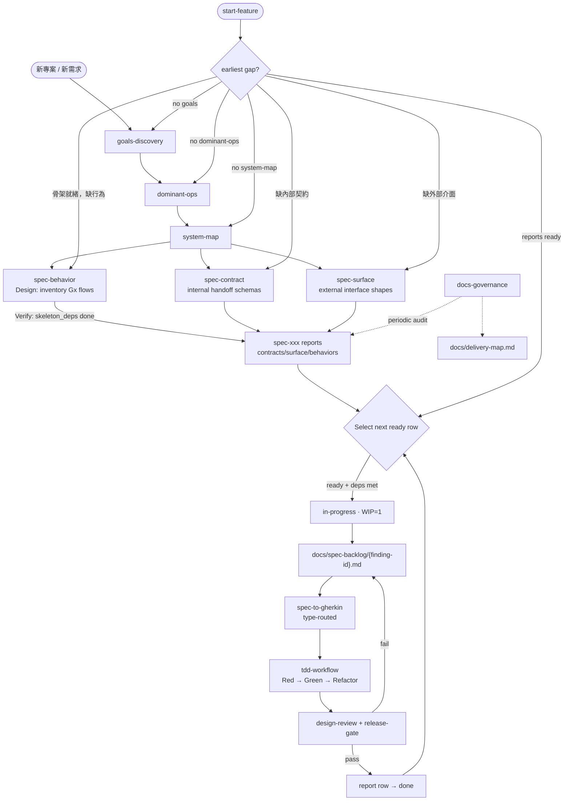

# insight-to-quality

一套 Claude Code skills，從**架構理解到程式碼品質**建立完整的可追溯鏈——確保「我們在蓋什麼」到「蓋得對嗎」之間不遺失資訊。

## 為什麼做這個

用 AI agent 開發時，我遇到兩類問題：

**理解問題**（寫 code 之前）：
- 還沒理解系統壓力在哪就跳進實作
- 多 agent 開發時容易迷失目標跟設計決策
- 技術選擇基於習慣而非追溯到約束條件

**實作問題**（寫 code 時）：
- 測試覆蓋率缺口、mock 邊界畫錯、跨元件資料形狀對不上
- 測試過了但設計品質很差
- 說「完成了」但其實沒跑過 lint 或 type check

### 核心信念

**Bad research 會衍生出更多 bad plans，而一個 bad plan 可以衍生出大量的 bad code。**

如果一開始就沒搞清楚系統的目標和壓力在哪，後面的每一個 spec 都可能在錯誤的方向上寫得很精確。修正一個 spec 的成本是可控的，但如果 10 個 spec 全都基於錯誤的前提，回頭成本會爆炸性增長。

所以 discovery 存在的目的是：**在寫任何 spec 之前，先用結構化的方式把理解做對。**

---

## 思考框架

整套 skill 建立在兩套互補的思維模型上：**architect mindset** 指導 discovery 階段的設計思維，**implementation mindset** 指導實作階段的品質決策。

### Architect Mindset — 設計品質 = 變動下的穩定性

好的設計不是優雅地處理今天的需求——是明天需求改變時，漣漪效應最小。每個設計決策都應該透過這個鏡頭評估。

#### 邊界三測試

畫任何邊界（模組間、服務間、階段間、層間）時，三個測試全通過才算正確：

1. **獨立變更測試**：改邊界一側，另一側不需要改嗎？
2. **變更原因測試**：兩側因為**不同**的原因改變嗎？
3. **故障隔離測試**：一側故障時，另一側能維持有效狀態嗎？

任何一個測試失敗，邊界大概畫錯了。

#### 文檔層級 = 抽象層級

每份 discovery 文件回答**剛好一個問題**。一個細節屬於哪份文件，取決於移除它會改變哪份文件的答案。

| 文件 | 回答的問題 | 改變訊號 |
|------|-----------|---------|
| goals.md | 系統必須做什麼 / 不做什麼？ | 系統根本能力轉移 |
| dominant-ops.md | 壓力在哪裡？ | 最佳化目標轉移 |
| SYSTEM_MAP.md | 東西在哪、改了什麼會壞？ | 元件邊界或契約轉移 |
| 實作程式碼 | 單一元件內部怎麼運作？ | 只影響該元件 |

#### 壓力思維

不是所有操作都一樣重要。設計精力應集中在最關鍵的操作上：

```
關鍵度 = 頻率 × 代價 × 失敗影響
```

**失敗影響是最常被低估的維度。** 一個月跑一次但失敗會靜默毀損資料的操作，可能比每秒跑一次但無害的操作更關鍵。

**Top 3 法則**：最多只選三個主導操作。如果什麼都重要，等於什麼都不重要。

#### 可追溯性

每個設計決策都必須追溯到來源：

```
目標 (Gx) → 主導操作 (Dx) → 邊界/契約 → 實作
```

如果一個設計元素追溯不到任何目標或主導操作，質疑它的存在。如果一個目標沒有任何下游設計元素，它不是願望型的（搬到 Open Questions），就是缺實作（標記為缺口）。

#### 提問層級

Discovery 中，提問品質比回答品質更重要：

1. **「如果這個失敗了，最壞的情況是什麼？」** — 比「這重要嗎？」有效
2. **「你能想到 2-4 種不同的方式達成這個嗎？」** — 測試目標的抽象層級是否正確
3. **「移除這個，系統還成立嗎？」** — 分離必要跟想要
4. **「六個月後這還成立嗎？」** — 過濾暫態關注和穩定目標

### Implementation Mindset — 隱式決策 = 設計債

進到實作階段，核心原則是：**每個重要選擇都必須被宣告、可追溯、可驗證。** 隱式決策會累積成長期設計債——不是程式碼債，是沒人知道為什麼選這個做法的決策債。

#### 錯誤處理三決策

寫測試之前就要宣告，不是實作時才決定：

1. **Catch 邊界**：在哪一層捕獲？只在邊界 / 逐層包裝 / 選擇性捕獲
2. **錯誤分類**：domain errors（業務邏輯）、infrastructure errors（外部依賴）、programming errors（bug）
3. **恢復策略**：domain → 結構化回傳；infrastructure → fail fast / retry with backoff / 降級；programming → fail fast

#### 結構檢查五維度

設計審查時用來掃描的維度，不是全部都要完美，而是要能辨認出明確的違反：

1. **單一職責** — 每個模組只因一個原因改變
2. **依賴方向** — 依賴箭頭從不穩定指向穩定
3. **命名語義** — 名稱反映角色，不是實作細節
4. **可測試性** — 任何邏輯都能在不啟動整個系統的情況下測試
5. **一致性** — 相似概念用相似方式處理

#### Discovery Conflict Triage

實作過程中撞到跟 discovery 文件矛盾時，依影響範圍從最小到最大分四層：

| 層級 | 訊號 | 修正起點 |
|------|------|---------|
| Level 0 — 只改 code | 測試不需改 | 直接改 code |
| Level 1 — 改 spec 實作 | 行為/細節變，邊界不變 | finding card → TDD from Red |
| Level 2 — 改契約/邊界 | 資料跨邊界形狀變 | SYSTEM_MAP → index/card → TDD |
| Level 3 — 改目標/主導操作 | 系統目的或壓力排序有誤 | goals/dominant-ops → 全部下游級聯 |

**不跳過中間文件**。Level 3 不能直接改 code，要從 goals 一路更新到實作。

---

## 跨 Agent 交接：文件如何保住上下文

多 agent 協作或多 context window 開發時，最大的風險是**上下文遺失**。Agent A 做的設計決策，Agent B 不知道；Window 1 改的契約，Window 2 沒跟上。

本套 skill 用三層機制解決這個問題：

### 1. 結構化文件鏈 — 每份文件都有 ID

```
G1（目標）→ D2（主導操作）→ AP1（反模式）→ Seam B（邊界）→ contract-001（finding card）→ .feature（測試）
```

每一層都用 ID 引用上一層。不是裝飾性引用——如果你改了 G1 的定義，你可以沿著鏈找到所有會被影響的下游文件。

### 2. SYSTEM_MAP 作為共享地圖

SYSTEM_MAP.md 是所有 agent 和 context window 的共享參考點。它的 **Change Protocol** 按影響範圍分四種類型：

- **Type 1**（改目標）：影響最大，需要檢查主導操作是否改變
- **Type 2**（改契約/邊界）：中等影響，需要同時更新兩側
- **Type 3**（改元件內部）：最小影響，只需驗證輸出契約不變
- **Type 4**（加新元件）：需要定義新的邊界和契約

任何 agent 在動手前查 Change Protocol，就知道自己的改動會影響什麼。不需要「問一下別人」或「全部看一遍」。

### 3. Spec Reports + Finding Cards 作為執行佇列

`docs/contracts/contracts-report.md`、`docs/surface/surface-report.md`、`docs/behaviors/behavior-report.md` 的主表列，是 finding 狀態來源（report-row driven）。任何 agent 接手時，看對應 report row 就知道：

- 什麼已經做完（done）
- 什麼正在進行（in-progress）
- 什麼可以開始（ready）
- 什麼還缺依賴（draft）

Finding card（`docs/spec-backlog/{finding-id}.md`）是單一實作 spec，包含所有做這件事需要的上下文：來源、目標、邊界、行為規格、錯誤處理策略、完成標準。一個 agent 不需要讀完所有 discovery 文件就能正確實作一個 finding。

### 4. Delivery Map 作為導航地圖

`docs/delivery-map.md` 是中間層全局視圖，把 SYSTEM_MAP 的邊界/旅程串聯到 finding/feature/測試覆蓋。三跳之內從架構邊界導航到具體測試：

```
SYSTEM_MAP seam → delivery-map row → finding card / .feature
```

---

## 怎麼訂目標

`goals-discovery` 是整條鏈的根。如果根有問題，所有下游文件都建在錯誤的基礎上。

### 核心原則

- **引導而非代筆**：Agent 是 facilitator，不是作者。使用者比 agent 更了解自己的領域
- **非目標跟目標一樣重要**：非目標約束設計空間——說「不做 X」比說「做 Y」更能縮小可能的架構
- **少而精**：8-12 個清楚的目標勝過 25 個模糊的目標

### 目標品質三測試

每個候選目標都要通過三個測試：

1. **替換測試**：把實作細節換掉，這句話還成立嗎？不成立 → 太具體了
2. **雙設計測試**：能想到 2-4 種不同架構都能滿足這個目標嗎？不能 → 太具體了。能想到 20+ 種 → 太模糊了
3. **六個月測試**：六個月後這還成立嗎？不確定 → 它屬於 spec，不屬於 goals

### 雙層模式

當一個目標同時描述現在需要的能力和未來希望減少依賴的方向時，拆成兩層：

- **Functional Goal** [STABLE]：系統必須支援 X（架構能力）
- **NFR** [EVOLVING]：追蹤 X-rate 並設定減少目標（品質度量）

這避免一個目標混合穩定的架構決策和會移動的品質指標。

### NFR 必須量化

「快」不是 NFR，是許願。每個 NFR 都要定義：
- **度量**：量什麼？
- **目標**：什麼數字算成功？
- **量測方法**：怎麼知道有沒有達到？

---

## 怎麼做系統設計

系統設計分兩步：先用 `dominant-ops` 釐清壓力在哪，再用 `system-map` 根據壓力做技術決策和邊界劃分。

### Dominant-Ops：壓力優先，不是功能優先

不是在列功能——是在辨識時間、金錢和風險集中在哪裡。流程是：

1. **全盤列舉**：列出所有重要操作（Operations Inventory），不跳過直接選 Top 3
2. **關鍵度評分**：頻率 × 代價 × 失敗影響
3. **強制排序 Top 3**：D1/D2/D3，不能超過 3 個，不夠關鍵就只留 D1/D2
4. **Design Implications**：每個 Dx 根據壓力特性（高頻讀取、高失敗代價、即時回饋…）追問技術維度，使用者做決策或標記「TBD — carry to system-map」
5. **反模式（APx）**：保護 Dx 的具體禁令，每個必須引用保護哪個 Dx
6. **理論極限（Theory Limits）**：每個 Dx 的理論最佳時間、束縛約束、跟現狀的差距

Design Implications 是壓力和技術決策之間的橋樑。Agent 的角色是**結構化追問**，確保使用者對每個相關維度有意識地過一遍——不替使用者做技術判斷。

### System-Map：把壓力變成架構

SYSTEM_MAP.md 是地圖，不是設計文件。30 秒內要能掌握全貌。

1. **技術棧決策**：消費 dominant-ops 的 Design Implications，把「TBD」解決為具體技術選擇，每個選擇都要引用驅動它的 Dx
2. **Component Map**：元件表 + Mermaid 圖，帶技術標註。正確粒度是「一個開發者能獨立擁有、改變、部署的單位」，8-15 個元件
3. **Boundary Map**：最有價值的部分——每個 seam 都有 Architecture Decision（driven by / decision / rationale / technology），回答「我改了 X，什麼會壞？」
4. **Change Protocol**：四種類型的變更指南，任何 agent 動手前查一下就知道影響範圍

**邊界三測試**應用在每個 seam 上。如果一個 seam 沒有 `driven by` 引用任何 Dx，質疑它是不是真的需要。

**Infrastructure 決策不開 finding card**——它們是 SYSTEM_MAP 的 Architecture Decision。如果 alignment 途中發現 infrastructure 缺口，升回 SYSTEM_MAP 補上，不是開卡。

---

## 怎麼做程式設計

alignment 和 spec backlog 之間，有一個關鍵的區分：**骨架（skeleton）和功能（feature）**。

### 骨架 vs. 功能

| 層次 | 定義 | 來源 | 測試路徑 |
|------|------|------|---------|
| **骨架** | 資料契約、schema、邊界保護 | spec-contract / spec-surface | `tests/features/contracts/` |
| **功能** | 功能邏輯、使用者流程、業務行為 | spec-behavior | `tests/features/behaviors/` |

**骨架必須先建**——它是功能的生長邊界。契約保護 AI 實作不會走歪，填錯了測試就會打回來。

在既有系統中，這個區分不明顯——功能已存在，alignment 主要找缺少保護的骨架。在全新系統中問題就會浮現：alignment 跑完只有契約缺口，Gx 的功能實作無處承接——spec-behavior 填補這個缺口。

### 骨架內部再細分：Contract vs Surface（重要）

雖然 `spec-contract` 與 `spec-surface` 都是 `skeleton`，但它們保護的是**不同邊界**，下游寫測試與審查時必須分開看：

| 類型 | Skill | 邊界位置 | 主要問題 | 典型測試重點 |
|------|-------|---------|---------|-------------|
| **Contract Skeleton** | `spec-contract` | 系統內部元件之間（handoff） | 內部資料交接有沒有 schema 保護、是否會 drift | handoff 形狀、欄位約束、邊界拒收策略 |
| **Surface Skeleton** | `spec-surface` | 外部 actor 與系統介面（API/CLI/event） | 對外契約是否穩定、client-visible error shape 是否一致 | request/response/event shape、error contract、邊界可預期性 |

這個細分會直接影響下游：
- `spec-to-gherkin`：同樣是 skeleton，但 `contract-*` 走 contract guide，`surface-*` 走 surface guide
- `tdd-workflow`：contract skeleton 可偏內部 handoff 驗證；surface skeleton 要強調外部可見契約
- `design-review`：contract gate 看內部 drift/兼容性；surface gate 看外部契約破壞風險

### 三種 Spec Skill 各自開自己的卡

| Skill | 掃描單位 | 開的卡片 type | 測試錨點 |
|-------|---------|-------------|---------|
| spec-contract | 資料流中的 handoff | skeleton | 合法形狀通過、非法形狀在邊界被擋下 |
| spec-surface | 系統對外暴露的介面 | skeleton | 外部介面接受合法輸入、產出宣告的輸出 |
| spec-behavior | Gx 下的使用者流程 | feature | 使用者完成行為、系統正確回應 |

### 覆蓋率分析：同一套六類、不同的錨點

寫 Gherkin 之前，每個 finding 都要通過六類覆蓋率分析——但骨架和功能的錨點根本不同：

| 類別 | 骨架錨點 | 功能錨點 |
|------|---------|---------|
| Happy path | 合法 schema 通過邊界 | 使用者完成 Gx 目標 |
| Error / Failure | 非法形狀、缺欄位、錯型別 | 業務規則違反、流程中斷 |
| Boundary & Edge | 空值、最大長度、可選欄位缺席 | 業務邏輯邊界（數量上下限、時間窗口） |
| Business rules | 欄位約束（enum、格式） | 條件分支（if A then B、狀態機轉換） |
| State mutation | Schema 版本變更不壞掉消費端 | 狀態轉換正確性、寫入後的持久化 |
| Output contract | 錯誤回應形狀符合宣告的契約 | 使用者可觀察的回應符合預期 |

### TDD：骨架跟功能的邊界不同

進到 `tdd-workflow` 時：

- **骨架 TDD**：schema validation + boundary guards。Domain behavior 可以 stub——這一輪不測業務邏輯，只測契約有沒有被遵守
- **功能 TDD**：真正的業務邏輯。假設骨架測試已通過，可以依賴既有的 skeleton protections——不需要在功能測試裡重新驗證形狀

### Design Review：測試過了不代表設計好

TDD 綠燈後，`design-review` 做兩件事：

1. **設計審查**：宣告的決策有沒有被遵守？結構是否違反五維度？code risk（正確性、狀態/交易、併發、錯誤處理、安全、效能）
2. **Release Gate**：refactor 後測試還是綠的嗎？lint + type check 通過嗎？git status 乾淨嗎？discovery 文件需要同步嗎？

---

## 讓這套流程真正發揮作用

這套 plugin 提供結構，但**內容來自真實的互動**。這個差別決定了你能從中得到多少。

### 什麼樣的互動能放大效果

- **你比 agent 更了解你的領域。** 當 agent 問「這個操作失敗會怎樣？」，你的答案直接決定 D1 的 failure impact 分析準不準確
- **Push back 比附和更有價值。** 「這個不對，因為...」比「聽起來不錯」產生更多洞見
- **「我不知道」是有效的答案。** Theory Limits 可以標 `[estimate]`，Open Questions 可以是真的未決定——承認不確定比假裝確定更有用

### Plugin 抓不到什麼

Skills 驗證的是**輸出形狀**，不是**推理品質**。一個 agent 可以填滿 Theory Limits 表格而沒有真正想過 binding constraint 是什麼。如果互動是機械性的——使用者隨意回應、agent 快速填格——文件看起來完整，但裡面沒有真實的 insight。這不是 plugin 能解決的問題。

---

## 完整流程



### Discovery 階段

| Skill | 做什麼 | 輸出 |
|-------|--------|------|
| **goals-discovery** | 定義目標、非目標、NFR、約束條件 | `goals.md` |
| **dominant-ops** | 找出壓力所在 + Design Implications | `dominant-ops.md` |
| **system-map** | 技術棧決策、元件地圖、邊界地圖、Change Protocol | `SYSTEM_MAP.md` |

### Alignment 階段

| Skill | 掃描單位 | Finding type | 模式 |
|-------|---------|-------------|------|
| **spec-contract** | 內部元件間的資料 handoff | skeleton | Design（盤點全部）/ Verify（逐一審計） |
| **spec-surface** | 對外介面邊界（API/CLI/event） | skeleton | Design（盤點全部）/ Verify（逐一審計） |
| **spec-behavior** | Gx 下的使用者流程 | feature | Design（盤點 Gx 流程）/ Verify（骨架依賴完成後） |

### 實作階段

| Skill | 做什麼 |
|-------|--------|
| **spec-to-gherkin** | 六類覆蓋率分析 + type-routed Gherkin 寫作 |
| **tdd-workflow** | 嚴格 Red → Green → Refactor |
| **design-review** | 設計審查 + release-gate 驗證 |

### 治理與輔助

| Skill | 做什麼 |
|-------|--------|
| **docs-governance** | 定期小範圍文檔稽核（非每次實作都跑） |
| **start-feature** | 功能入口：路由到最早缺口 |
| **gherkin** | 輔助：直接編修 .feature（非預設路徑） |
| **pre-complete** | Legacy：獨立 pre-complete（已整合進 design-review） |

---

## 開發情境

不同情境走不同路徑——不是每件事都需要從頭跑完整個流程。

| 情境 | 起點 | 路徑 |
|------|------|------|
| **全新專案** | 沒有 discovery 文件 | 完整 discovery → spec-contract/spec-surface/spec-behavior → 實作 |
| **舊專案接手** | 有 code 但沒有文件 | 考古 → 安全網（characterization tests）→ discovery（驗證模式）→ 漸進重構 |
| **有具體功能想法** | Discovery 完成 | start-feature → 路由到最早缺口 |
| **從已知 gaps 挑下一個做** | spec-xxx reports 有 ready 列 | 直接從對應 report row 挑 → 實作 |
| **MVP 完成後迭代** | 活的 discovery 文件 | Delta update：找到最早被影響的那一層，從那裡往下更新 |
| **實作中發現衝突** | 實作撞牆 | Discovery Conflict Triage 判斷層級，從對應層往下修 |

---

## 安裝

```bash
# 加入 marketplace
/plugin marketplace add class83108/insight-to-quality

# 安裝 plugin
/plugin install insight-to-quality
```

## 專案先決條件

在專案的 `CLAUDE.md` 裡需要一個 **Commands** 區段，告訴 agent 怎麼跑測試、lint、type check。Skills 不假設任何特定工具。

### 建議的工具組合

- **uv** — 套件管理
- **pytest + pytest-bdd** — 測試
- **ruff** — lint & format
- **pyright** — 型別檢查

---

## 關於迭代

這是我個人開發流程的產物——把「我開發時怎麼想、怎麼檢查」自動化成 skills。會隨著日常使用的感受持續進化。
