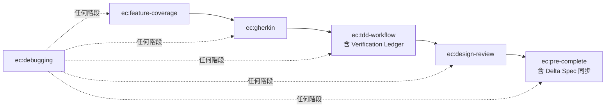

# spec-to-quality

一套給 Claude Code 用的 Python TDD 工作流 Skills。核心目標是讓需求到程式碼之間的資訊流失盡可能少，同時確保產出的 code 有一定的設計品質。

## 為什麼做這個

使用 claude code 進行開發時，我常常會遇到一些問題：

- 從 spec 到 .feature 檔，AI 生成的 edge case 跟 error handling 可能每次都不太一樣，很容易只把重點放在我強調的部分
- 從 .feature 到測試，step definitions 常常沒有完整對應 scenario
- 測試通過了，但 mock 邊界畫錯——spec 要求驗證的邏輯被 `MagicMock()` 整個遮掉，測試綠了但什麼都沒驗證到
- 單元件測試都過，但元件接起來時資料形狀對不上，跨元件的接合處沒人守門
- 測試通過了，但 code 的設計很糟——職責混在一起、依賴方向亂跑
- 說「完成了」，但其實沒跑過 lint 或 type check

這些問題單獨看都有工具可以解：OpenSpec 可以管 spec、pytest-bdd 可以綁 feature 跟測試。但問題是**沒有東西能讓這整段流程每次都穩定跑完**。有時候 auto edit 開下去蠻多在 claude.md 說好的內容還是蠻容易被忽略的

所以我把這套流程包成 6 個 Claude Code skills，用前置條件串起來，強制按順序走：



不過要聲明一下這不適合做全自動化開發，這是一套按照我開發流程習慣所生的產物，目的是希望在我的每次開發時都能夠有相對平穩的輸出。

## Skills 在幹嘛

| Skill | 做什麼 |
|-------|--------|
| **ec:feature-coverage** | 寫 .feature 之前，強制對 6 類 scenario 逐一分析，避免漏掉情境 |
| **ec:gherkin** | 照著覆蓋率分析的結果寫 .feature，遵循 Feature / Rule / Scenario 結構（關鍵字英文、內容繁體中文） |
| **ec:tdd-workflow** | 寫測試前先做 Verification Ledger（mock 邊界審查），然後嚴格 Red → Green → Refactor |
| **ec:design-review** | 綠燈之後的設計審查，用提問方式引導思考，不是直接叫你改 |
| **ec:debugging** | 遇到 bug 先收集證據、建假說、驗證，不准猜著改 |
| **ec:pre-complete** | 要說「完成」之前，跑完測試 + lint + type check + delta spec 同步 + 整合測試缺口確認，拿到實際輸出才算數 |

## 適合什麼情境

- Python 後端，有用 pytest-bdd，並且有使用 ruff, pyright 等 CI 常見工具
- 想讓 TDD 流程穩定下來，不要每次都不一樣
- 同時讓 TDD 意義最大化，有測試的保護下，可以審視剛剛的設計看需不需要重構

## 不適合什麼

- 前端開發
- 寫個小 script、改 config、快速原型
- 沒在用 pytest 或 Gherkin 的專案，如果都完全沒接觸過應該會非常痛苦

## 安裝

```bash
# 加入 marketplace
/plugin marketplace add class83108/spec-to-quality

# 安裝
/plugin install spec-to-quality@spec-to-quality
```

## 你的專案需要準備什麼

在專案的 `CLAUDE.md` 裡面要有一個 **Commands** 區段，告訴 agent 怎麼跑測試、lint、type check。因為每個專案的工具不同，skills 不會假設你用什麼。

參考 [templates/CLAUDE.md.example](templates/CLAUDE.md.example) 看範例。

### 建議的工具組合

這套 skills 是圍繞這些工具設計的：

- **OpenSpec** — 需求與變更管理（skills 會讀 spec 內容來輔助覆蓋率分析）
- **uv** — 套件管理
- **pytest + pytest-bdd** — 測試
- **ruff** — lint & format
- **pyright** — 型別檢查

參考 [templates/pyproject.toml.snippet](templates/pyproject.toml.snippet) 看建議設定。
**如果未來哪個步驟出現更適合我的新工具，那這個 skill 也會跟著進行更新**

## 選用整合

- **Feature Scenario 具體化對應表**：可以在專案 CLAUDE.md 加一個表，把 6 類通用 scenario 類別對應到你專案的概念（例如「Error paths → Celery task timeout」）
- **OpenSpec**：使用 OpenSpec 管理 spec 的話，tdd-workflow 會從 spec.md 提取 SHALL 語句做 Verification Ledger，pre-complete 會檢查 delta spec 是否同步到主規格。新專案記得先跑 `openspec init`

## 關於迭代

這套 skills 目前跑過幾輪 eval（用 `claude -p` 對比 with/without skill 的輸出差異），確認基本行為符合預期，也根據 eval 結果修了一些 SKILL.md 的寫法。最近一輪 eval（v0.2.0）的重點結果：

| Eval | with_skill | without_skill | Delta |
|------|-----------|--------------|-------|
| Verification Ledger（mock 邊界審查） | 7/7 | 0/7 | +7 |
| Gherkin 關鍵字語言 | 5/5 | 5/5 | 0 |
| 整合測試時機判斷 | 4/6 | 1/6 | +3 |

但還沒有在大量真實 session 中長期驗證過。

老實說，這本來就是我個人開發流程的產物 — 相當於「如果我手動開發的話，我大概會怎麼想、怎麼檢查」的自動化版本。所以：

- **一定有定義更好的工具**。專門做 code review 的、專門驗證 Gherkin 寫法的、專門做 mutation testing 的，這些在各自領域都比我這邊做得更深入
- **這套的重點是流程串接**。不是每一步都做到最好，而是確保從 spec → .feature → test → code → review → 完成這條路每次都穩定走完，不跳步驟、不漏東西
- **會持續迭代**。只要我在日常開發中發現哪裡用得不順手，或是軟體開發的工具鏈有什麼新進展，skill 就會跟著更新。eval workspace 也一起放在 repo 裡，方便追蹤每次改動的前後對比
