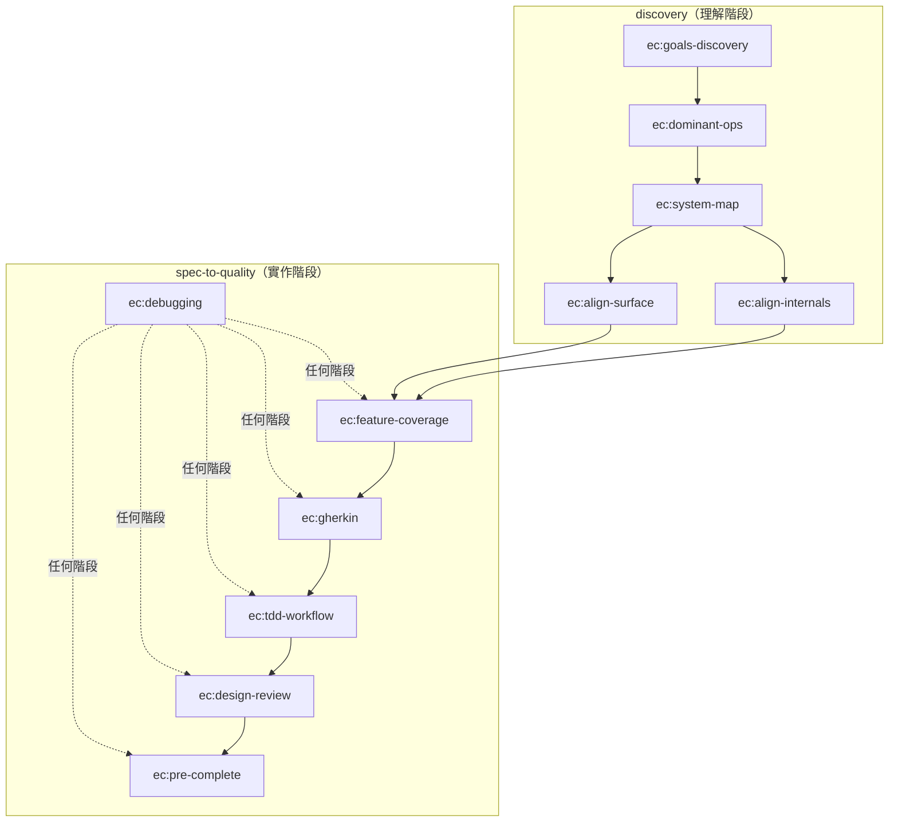

# insight-to-quality

一套 Claude Code skills，涵蓋從**架構理解到程式碼品質**的完整弧線——兩個 plugin 協同運作，確保從「我們在蓋什麼？」到「蓋得對嗎？」之間不遺失資訊。

## 為什麼做這個

用 Claude Code 開發時，我遇到兩類問題：

**理解問題**（寫 code 之前）：
- 還沒理解系統壓力在哪就跳進實作
- 多 agent 開發時容易迷失目標跟設計決策
- 技術選擇基於習慣而非追溯到約束條件

**實作問題**（寫 code 時）：
- Spec 到測試的覆蓋率缺口、mock 邊界畫錯、跨元件資料形狀對不上
- 測試過了但設計品質很差
- 說「完成了」但其實沒跑過 lint 或 type check

### 核心觀點

**Bad research 會衍生出更多 bad plans，而一個 bad plan 可以衍生出大量的 bad code。**

如果一開始就沒搞清楚系統的目標和壓力在哪，後面的每一個 spec 都可能在錯誤的方向上寫得很精確。修正一個 spec 的成本是可控的，但如果 10 個 spec 全都基於錯誤的前提，回頭成本會爆炸性增長。

所以 `discovery` 存在的目的就是：**在寫任何 spec 之前，先用結構化的方式把理解做對。** 而 `spec-to-quality` 則確保理解正確之後，實作過程不走樣。

## 兩個 Plugin



### discovery — 架構理解

5 個 skills，從「這系統是什麼？」引導到「內部跟介面有沒有對齊真正重要的東西？」

| Skill | 做什麼 |
|-------|--------|
| **ec:goals-discovery** | 定義系統目標、非目標、NFR 跟約束條件 |
| **ec:dominant-ops** | 找出壓力所在（頻率 x 代價 x 失敗影響） |
| **ec:system-map** | 建立導航地圖：Component Map、Boundary Map、Change Protocol |
| **ec:align-internals** | 設計或驗證 contracts 與 persistence 的對齊 |
| **ec:align-surface** | 設計或驗證使用者介面與基礎設施的對齊 |

align 系列支援兩種模式：**設計模式**（沒有現成 code，引導設計）和**驗證模式**（有現成 code，審計對齊狀況）。

#### SYSTEM_MAP 的設計目的

SYSTEM_MAP.md 不只是一份架構文件——它是**多 agent 協作和多視窗開發時的共享地圖**。

在實際開發中，不管是多個 Claude Code agent 同時工作，還是開發者自己開多個 context window 處理不同功能，最常遇到的問題是：「我改了 A，會不會影響 B？」「這個 spec 應該動到哪些檔案？」。如果每次都要重新理解一遍架構，效率會非常低。

SYSTEM_MAP 的 **Change Protocol** 就是為了解決這個問題——它按照影響範圍分成四種 type，讓任何 agent 或開發者在動手前就知道需要碰哪些東西。這讓平行開發時每個人（或 agent）都能獨立判斷自己的改動範圍，而不是靠「問一下別人」或「全部看一遍」。

### spec-to-quality — 實作品質

6 個 skills，強制穩定的 TDD 工作流程從 spec 到完成。

| Skill | 做什麼 |
|-------|--------|
| **ec:feature-coverage** | 寫 .feature 前，強制分析 6 類 scenario 覆蓋率 |
| **ec:gherkin** | 照覆蓋率分析結果寫 .feature |
| **ec:tdd-workflow** | Verification Ledger + 嚴格 Red-Green-Refactor |
| **ec:design-review** | 綠燈後的設計品質審查，用提問引導 |
| **ec:debugging** | 證據先行的 debugging，可在任何階段觸發 |
| **ec:pre-complete** | 最終關卡：測試 + lint + type check + delta spec 同步 |

## 交接：discovery 到 spec-to-quality

Discovery 產出三份核心文件，加上兩次對齊驗證，形成完整的交接：

### 核心文件

| 文件 | 產出者 | 消費者 |
|------|--------|--------|
| `goals.md` | ec:goals-discovery | 所有下游 skill 的可追溯性根源 |
| `dominant-ops.md` | ec:dominant-ops | ec:tdd-workflow（anti-patterns 影響 mock 邊界）、align skills（Dx 優先序） |
| `SYSTEM_MAP.md` | ec:system-map | Change Protocol 指導所有實作決策、多 agent 協作的共享地圖 |

### 對齊驗證

| 對齊類型 | 驗證者 | 確認什麼 |
|----------|--------|----------|
| 內部對齊 | ec:align-internals | 每個 seam 有 contract、每個 goal 有 persistence、Dx 路徑上的 contract 品質足夠 |
| 表面對齊 | ec:align-surface | 每個 Dx 的 user journey 有對應介面、endpoint 分類正確、基礎設施容量足以承受壓力 |

**對齊完成後**，才開始用 `ec:feature-coverage` 進行第一個 OpenSpec change。SYSTEM_MAP.md 裡的 Change Protocol 會告訴你這是什麼類型的變動、需要動到哪些地方。

## 安裝

```bash
# 加入 marketplace
/plugin marketplace add class83108/insight-to-quality

# 安裝兩個 plugin
/plugin install insight-to-quality@discovery
/plugin install insight-to-quality@spec-to-quality
```

## 你的專案需要準備什麼

在專案的 `CLAUDE.md` 裡面要有一個 **Commands** 區段，告訴 agent 怎麼跑測試、lint、type check。Skills 不會假設任何特定工具。

參考 [templates/CLAUDE.md.example](templates/CLAUDE.md.example) 看範例。

### 建議的工具組合

- **OpenSpec** — 需求與變更管理
- **uv** — 套件管理
- **pytest + pytest-bdd** — 測試
- **ruff** — lint & format
- **pyright** — 型別檢查

## 關於迭代

這是我個人開發流程的產物——把「我開發時怎麼想、怎麼檢查」自動化成 skills。會隨著日常使用的感受持續進化。

- 兩個 plugin 可以獨立迭代
- Eval workspace 放在 repo 裡，方便追蹤每次改動的前後對比
- 如果某個步驟出現更好的工具，skill 會跟著更新

版本歷史見 [CHANGELOG.md](CHANGELOG.md)。
