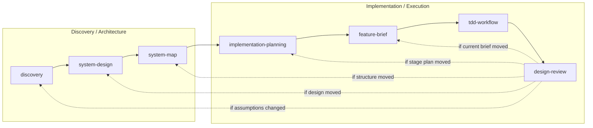

# insight-to-quality

`insight-to-quality` 是一套給人類與 AI agent 協作開發時使用的 workflow skill。

它存在的原因很簡單：

當專案開始變複雜，或討論橫跨多個 session、多個 agent、多次 plan mode / implementation mode 切換時，最常見的問題不是「想不到點子」，而是：

- 每次都重新討論一輪，沒有穩定累積
- 不同輪對話使用不同抽象層，需求、設計、結構、實作混在一起
- LLM context window 與快取有效時間有限，導致之前的重要判斷慢慢漂掉
- 到真正開始寫 code 時，已經沒有一份穩定的 shared document 能讓後續 agent 直接接手

這套 skill 的核心目的，就是把這些容易漂移的討論，收斂成少數幾份**能夠跨回合累積、跨 agent 接手、而且能一路往下推進實作**的核心文檔。

它不是要把所有事情文件化，也不是要把所有需求一次問完。
它要做的是：

- 先把系統輪廓講清楚
- 再把關鍵設計決策與 trade-off 講清楚
- 再把軟體結構、ownership、seams 講清楚
- 再規劃實作階段與當前工作，往 TDD、review 推進

換句話說，這套 skill 比較像是在建立一條**穩定可累積的開發討論骨架**，而不是幫你一次攤平所有細節。

---

## 這套 skill 適合誰

它特別適合這些情境：

- 你要和 AI agent 長時間協作開發，不希望每次都從頭重新對齊
- 你希望 plan mode 產出的內容能沉澱成穩定文檔，而不是只留在聊天紀錄裡
- 你的專案有明確的系統行為、設計取捨、結構切分、實作順序，這些東西值得被逐層釐清
- 你希望後續不同 agent 或未來的自己，可以根據既有文檔直接往下推，而不是再重開一輪 discovery
- 你在意「現在這段 code 為什麼這樣切、這個測試在保護什麼、這個 stage 為什麼先做」

比較典型的例子是：

- 有明確 domain / workflow 的後端或全端專案
- 需要逐步落地的 AI agent / AI workflow 專案
- 會跨多次討論與多輪實作的中小型產品開發

---

## 這套 skill 不適合什麼

它不太適合這些情境：

- 你只是要快速試一個非常短的小 prototype，幾十分鐘內就能直接寫完
- 你主要在做純視覺探索型的前端設計，重點在畫面風格、動效、版面迭代，而不是穩定的 system shape
- 你的專案本質上不是單一系統或單一產品，而是高度分散的多團隊微服務治理問題，這時候這套 flow 只能覆蓋其中某個服務或某個 bounded context，不適合直接拿來當整個組織層的架構方法

- **純前端設計**：通常不太適合完整套用這條流程，除非那個前端本身有很強的互動狀態、資料流、或 domain workflow。
- **微服務架構專案**：不是完全不適合，而是不要把它拿來一次描述整個服務群；比較適合把它用在其中一個具體服務、某條跨服務流程、或某個明確 bounded context。

---

## 這套 skill 做不到什麼

它不會幫你：

- 一次把所有需求、例外、邊界情況全部鋪平
- 自動保證文檔一定正確
- 取代實際的技術判斷、實驗、測試與 code review
- 讓 agent 用無止盡提問把整個專案問乾淨

這套 flow 的提問方式比較像：

- 只抓目前這一層最重要的問題
- 問到足以支撐下一層即可
- 把剩下的細節留到更接近實作時再展開

所以如果你期待的是：

- 一開始就把所有內容完整攤平
- 一開始就產出完整 schema / API / edge cases / 全測試案例

那這套 skill 不會符合這種期待。

它追求的是**逐層收斂、持續累積、每一層只回答自己該回答的問題**。

---

## 主流程

1. `discovery`
2. `system-design`
3. `system-map`
4. `implementation-planning`
5. `feature-brief`
6. `tdd-workflow`
7. `design-review`

這不是 rigid waterfall。
如果問題屬於更上游的層，就往上回推，不要用 local code 硬補。

---

## 核心理念

這套 plugin 不是在推「先寫一堆文件」，而是在推一組很具體的工程原則：

- 先讓系統可被誠實描述，再討論設計或實作
- 抽象層要穩定，不要在同一份文檔裡混需求、設計理由、結構切分、實作細節
- 只有當系統真的需要時，才把某個 object 命名成 entity / record
- 先看核心資料與互動，再決定 seam 應該切在哪裡
- 測試層級應跟著風險走，不是每個 slice 都先寫一樣的 test
- 當實作推翻了原本假設，要回寫上游，而不是把問題藏進 local code

如果濃縮成一句話，就是：

**先把 system shape 與 change pressure 說清楚，再開始寫會長期存在的 code。**

---

## 流程架構圖

這套流程可以粗分成兩大段：

- 前半段先把系統講清楚
- 後半段再把這些已知內容轉成可執行的開發行動



前半段的產出重點是：

- `discovery.md`
- `system-design.md`
- `system-map.md`

後半段的產出重點是：

- `docs/implementation-plan.md`
- `docs/features/<feature-slug>/brief.md`
- code / tests / review 結果

---

## 三份上游文檔

這三份文檔的目的，不是把所有資訊平均切三份。
它們比較像是一層一層收斂：

- 先確認系統在做什麼
- 再確認為什麼要這樣設計
- 最後把它翻成可實作的結構切分

只要這三層站穩，後面的 implementation planning 與 execution 就不需要每次都重開一輪高階討論。

### `discovery.md`

這一層要做到的是：

- 讓系統目標、範圍、第一版行為足夠清楚
- 讓後面的人不用猜「這個系統到底想完成什麼」

做到這裡之後，下一層 `system-design` 才能在一個穩定的 baseline 上討論：

- 哪些設計決策真的重要
- 哪些 alternatives 值得比較
- 哪些 trade-off 會 shape 後續系統

回答：

- 我們在解什麼問題
- 第一版系統要支撐什麼
- top-level API / interaction shape 是什麼
- baseline flow / high-level design 大致長什麼樣
- goals / non-goals / constraints / NFRs 是什麼

這一層的重點是：先把第一版系統輪廓勾出來。

核心做法：

- 先釐清 problem framing，再整理 system requirements
- 先定義 top-level interaction / API shape，再回頭整理 goals / non-goals
- 不提早掉進實作細節或元件切分

### `system-design.md`

因為 `discovery` 已經讓我們知道系統要做什麼、第一版大致長什麼樣，所以這一層可以開始處理：

- 為什麼這樣設計
- 哪些選擇是刻意的
- 哪些風險與 trade-off 值得被記錄

這一層要做到的是：

- 把少數真正 shape-defining 的 decisions 講清楚
- 讓下一層 `system-map` 不需要再回頭猜設計理由

回答：

- 在目前 baseline 下，最重要的幾個設計決策是什麼
- 為什麼這樣選，不是那樣選
- alternatives 是什麼
- trade-offs / risks 是什麼
- 哪些題目值得下一步 deep dive

這一層的重點是：把「為什麼這樣做」講清楚。

核心做法：

- 只抓少數真正 shape-defining 的 decisions
- 每個 decision 都要說明 alternatives 與 trade-off
- 不提早切 entity、module、ownership

### `system-map.md`

因為現在我們已經知道：

- 系統要做什麼
- 為什麼主要設計是這樣選

所以這一層可以開始回答更接近實作的問題：

- 系統應該怎麼切
- 哪些核心資料 / 狀態需要穩定命名
- 哪些 seam 與 handoff 需要被保護

這一層要做到的是：

- 把前面的故事與設計理由，翻成可實作、可維護、可安全修改的結構地圖
- 讓下一層 `implementation-planning` 可以直接開始討論開發順序與 stage，而不是還在抽象討論架構

回答：

- 系統裡有哪些主要 responsibility units
- 哪些核心 state / entity / workflow truth 由誰擁有
- 哪些 seams / handoffs 是關鍵邊界
- 改某件事時應該先看哪裡
- 最小資料形狀與 seam contract 應該長什麼樣

這一層的重點是：把已知輪廓與決策，展開成可開發、可維護的軟體結構地圖。

核心做法：

- 用 responsibility cut 取代模糊的元件清單
- 先找 core data / key state，再決定誰主責管理
- 先看 entity interaction，再畫 boundary / seam
- 只畫支撐實作所需的 minimum data shape，不過早定死完整 schema

---

## 實作規劃與執行

到了這裡，前面的高階討論應該已經有穩定骨架了。
這一段的重點不再是重新討論需求或設計，而是把既有結論轉成：

- 專案級的實作順序
- 當前工作單位
- 風險導向的測試與實作
- 完成後的回寫與收尾

換句話說，這一段處理的是：**怎麼把前面的理解真正落成 code。**

### `implementation-planning`

因為現在已經有上游三份文檔，所以這一層可以開始決定：

- 專案應先走哪些 stage
- 哪些是 enablement
- 哪些是 behavior
- 每個 stage 何時算完成

把上游三份文檔轉成專案層級的實作地圖：

- implementation stages
- 先後順序
- stage dependencies
- stage exit criteria
- current stage / blockers / next unlocks

共享協調文件：

- `docs/implementation-plan.md`

核心做法：

- 用 stage 而不是零散 task 看整個專案
- 明確區分 `enablement` 與 `behavior`
- 每個 stage 都要有 exit criteria，避免基礎建設無止盡膨脹

### `feature-brief`

因為 `implementation-planning` 已經選出了 current stage，所以這一層不再處理整個專案，而是只處理：

- 現在這一刀到底要做什麼
- 主要風險是什麼
- 應該在哪個測試層先保護它

在 current stage 已清楚後，把當前工作切成一份很短的 execution brief：

- `discovery.md`
- `system-design.md`
- `system-map.md`
- `docs/implementation-plan.md`

然後建立：

- `docs/features/<feature-slug>/brief.md`

brief 會包含：

- summary
- upstream anchor
- slice definition
- execution notes
- validation intent

其中 validation intent 會先說清楚：

- main risk to protect
- scenario bullets
- suggested primary layer

核心做法：

- brief 要短，但要能明確回答「現在到底做什麼」
- 風險先於測試工具或實作技巧
- scenario bullets 以「每個 scenario 一個簡短 bullet」為主；若用 `Given / When / Then`，也應維持在同一個 bullet 內

### `tdd-workflow`

因為現在 brief 已經把 current work、main risk、scenario bullets 釘住了，所以這一層可以直接處理：

- 先從哪個風險開始寫 Red
- 哪個測試層最誠實
- Green 與 Refactor 要做到哪裡為止

直接從 `brief.md` 進 Red -> Green -> Refactor。

重點不是補額外流程，而是用 brief 中已經寫清楚的：

- main risk
- scenario bullets
- suggested primary layer

來決定這一刀先測什麼、在哪一層測。

核心做法：

- `Red` 要驗證真實不確定性
- `Green` 只做到足夠通過
- `Refactor` 用來移除 drift，不是拿來掩蓋上游問題

### `design-review`

因為 work 已經實作完，所以這一層不再問「要做什麼」，而是回頭確認：

- 實作有沒有偏離 brief
- 實作有沒有推翻原本的 stage / structure / design 假設
- 哪些變化應該回寫上游

檢查：

- current work 是否仍對齊
- seams / ownership 是否 drift
- test strategy 是否真的被遵守
- 是否需要回寫 `feature-brief`、`implementation-planning` 或更上游文檔

核心做法：

- review 不是只看 code style
- 要回頭比對 brief、stage intent、system-map 假設是否還成立
- 如果實作改變了結構或順序假設，就應該 write back

---

## Shared Anchor

project-level implementation ordering 的共享協調文件是：

- `docs/implementation-plan.md`

current execution work 的共享協調文件是：

- `docs/features/<feature-slug>/brief.md`

後續 skill 應盡量沿用這兩份文件，而不是散落成許多無關筆記。

---

## 軟體開發中我們特別重視什麼

- 問題與抽象層對齊：不要用 implementation workaround 假裝回答需求或設計問題
- 變更導向的結構：responsibility、data shape、seam 應該幫助未來安全修改
- 風險導向的測試：先保護真正可能出錯的結果，而不是先保護最方便測的 helper
- 可追溯性：當假設變了，要知道該回哪一層修正
- 共享語言：同一個 object、stage、brief、risk 不要在不同文檔裡反覆換名詞

---

## 常見情況與建議路由

這一段的重點不是重複主流程，而是回答：

- 你現在手上有什麼
- 缺什麼
- 應該先補哪一層
- 做下去之後，什麼情況要回頭對齊

先講一個總原則：

- 不論新專案還是舊專案，**上游文檔最好都存在**
- 差別只在於：新專案通常從零開始產出；舊專案則常常是先補最缺的那一層，再一路往下接

所以不是只有新專案才需要 `discovery.md` / `system-design.md` / `system-map.md`。
舊專案如果沒有這些文檔，一樣可以補，只是補法通常要更貼近既有實作與既有限制。

### 1. 新專案，還沒有任何上游文檔

從 `discovery` 開始。

目標不是一次問完所有細節，而是先產出：

- `discovery.md`

讓系統目的、第一版範圍、top-level interaction 能被穩定描述。

接著再往下接：

- `system-design`
- `system-map`
- `implementation-planning`

### 2. 舊專案，已經有 code，但沒有上游文檔

不要直接跳去 `feature-brief` 或 `tdd-workflow`。

比較好的做法是：

1. 先補 `discovery`
   先把這個系統實際在做什麼、第一版或目前版在支撐什麼行為講清楚
2. 再補 `system-design`
   把目前實作背後已經存在的主要設計選擇與 trade-off 補出來
3. 再補 `system-map`
   把既有 codebase 反推成可維護的 responsibility / data / seam 地圖

這時候要明講一件事：

- agent 在補這些文檔時，應該考慮既有實作
- 如果文檔推導出的內容和現有 code 衝突，就要回來對齊，而不是假裝 code 不存在

### 3. 已經有 `discovery.md`，但沒有 `system-design.md`

這代表你已經知道系統要做什麼，但還沒有把「為什麼這樣設計」講清楚。

這時進 `system-design`。

目標是補出：

- key design decisions
- alternatives
- trade-offs
- risks

做完之後，`system-map` 才不需要自己猜設計理由。

### 4. 已經有 `discovery.md` 和 `system-design.md`，但還沒有 `system-map.md`

這代表你已經有：

- 需求輪廓
- 主要設計理由

但還沒有一份可直接支撐實作切分的結構地圖。

這時進 `system-map`。

目標是補出：

- responsibility units
- core data / state
- entity interaction
- minimum data shape
- seam contract
- implementation cut

做完之後，`implementation-planning` 才能誠實討論先做哪個 stage。

### 5. 已經有三份上游文檔，但不知道專案應該先做哪個階段

進 `implementation-planning`。

這時候不要直接切 feature。
先決定：

- 目前專案有哪些 stages
- 哪些是 `enablement`
- 哪些是 `behavior`
- 每個 stage 的 exit criteria 是什麼

### 6. 已經知道 current stage，但不知道現在這一刀要切到多小

進 `feature-brief`。

這一層的工作不是再做整個專案規劃，而是把 current stage 中的當前工作壓成一份可以直接進 TDD 的 brief。

如果 brief 寫完後還是很大、很模糊，通常表示：

- current stage 還沒切好
- 或 `system-map` 對某個 seam / data shape 其實還不夠穩

### 7. 已經有 brief，準備開始寫 code

進 `tdd-workflow`。

但前提是你手上至少要有：

- `docs/features/<feature-slug>/brief.md`

而且 brief 內要已經有：

- main risk to protect
- scenario bullets
- suggested primary layer

如果這些東西沒有，就不要硬進實作，先回 `feature-brief`。

### 8. 已經做完一段 work，但不知道這是不是只影響 local implementation

進 `design-review`。

這一層不是只看 code style，而是要判斷：

- 這次實作有沒有偏離 brief
- 有沒有推翻原本的 stage 假設
- 有沒有改變 responsibility / seam / minimum data shape
- 需不需要回寫上游文檔

功能開發完後，不要直接憑感覺手動改一堆文檔。
比較好的順序是：

1. 先進 `design-review`
2. 由 `design-review` 判斷這次變化到底停留在哪一層
3. 再回到對應 skill 由它主責更新那份文檔

常見回寫對象：

- 只是 current work 的邊界、scenario bullets、execution notes 變了 -> 回 `feature-brief` 更新 `docs/features/<feature-slug>/brief.md`
- stage 完成了，或 stage order / exit criteria / blocker 變了 -> 回 `implementation-planning` 更新 `docs/implementation-plan.md`
- responsibility / seam / minimum data shape / implementation cut 變了 -> 回 `system-map` 更新 `system-map.md`
- key decision / trade-off / design assumption 變了 -> 回 `system-design` 更新 `system-design.md`
- 系統目的、範圍、top-level interaction 變了 -> 回 `discovery` 更新 `discovery.md`

所以可以把 `design-review` 當成「功能做完後的回寫判斷入口」，而不是最後直接手改所有文檔的地方。

### 9. 實作中發現問題，但不知道該回哪一層

用這個判斷：

- 系統目的 / scope / top-level interaction 變了 -> 回 `discovery`
- key decision / trade-off 變了 -> 回 `system-design`
- ownership / seam / minimum data shape 變了 -> 回 `system-map`
- stage order / exit criteria / blocker 變了 -> 回 `implementation-planning`
- current work 太大或 brief 不夠清楚 -> 回 `feature-brief`

不要直接用 local code 把上游問題吞掉。

---

## 安裝

### Claude Code

#### 從 GitHub 安裝（推薦）

在 Claude Code 內執行：

```
/plugin marketplace add class83108/insight-to-quality
```

接著執行 `/plugin`，切到 **Discover** 頁籤，找到 `insight-to-quality` 並安裝。

安裝完成後執行：

```
/reload-plugins
```

#### 從本地路徑安裝

先 clone 這個 repo，再在 Claude Code 內執行：

```
/plugin marketplace add /path/to/insight-to-quality
```

接著同上，透過 `/plugin` → Discover 安裝，再執行 `/reload-plugins`。

---

### Codex

#### 從 GitHub 安裝（推薦）

```bash
codex plugin marketplace add class83108/insight-to-quality
```

接著執行 `codex /plugins`，切到 **Discover** 頁籤，找到 `insight-to-quality` 並安裝。

#### 從本地路徑安裝

先 clone 這個 repo，再執行：

```bash
codex plugin marketplace add /path/to/insight-to-quality
```

接著同上，透過 `codex /plugins` → Discover 安裝。

---

## 使用方式

最常見的使用方式是直接按照主流程逐層往下：

1. 先產出 `discovery.md`
2. 再產出 `system-design.md`
3. 再產出 `system-map.md`
4. 再產出 `docs/implementation-plan.md`
5. 為 current work 建立 `docs/features/<feature-slug>/brief.md`
6. 用 `tdd-workflow` 實作
7. 用 `design-review` 做收尾與 writeback 判斷

如果專案已經做到一半，不需要重跑整套流程。
直接從目前最缺的那一層進入即可。

---

## 開發中常見問題

### 文檔越寫越多，但還是不知道該做什麼

通常代表：

- `implementation-planning` 沒有明確切 stage
- 或 `feature-brief` 沒有把 current work 壓小

### 已經知道要做什麼，但不知道先補基礎建設還是先做功能

回 `implementation-planning`，先判斷這是：

- `enablement`
- `behavior`

並補上 stage exit criteria。

### 實作時發現 entity / seam 跟原本想的不一樣

不要直接在 code 裡默默改掉。
先回 `system-map` 更新結構假設。

### 測試很多，但沒有保護到真正風險

通常代表 `feature-brief` 的 `main risk to protect` 或 `scenario bullets` 寫得太弱。
先回 `feature-brief`，再重新進 `tdd-workflow`。

### 做完後不知道該不該改上游文檔

跑一次 `design-review`。  
它的目的之一就是幫你判斷這是不是單純 local implementation，還是已經改變了上游假設。

---

## 三份 Reference

- `references/design-decision-mindset.md`
  - 給 `discovery` / `system-design`
- `references/architect-mindset.md`
  - 給 `system-map`
- `references/implementation-mindset.md`
  - 給 `implementation-planning` 之後的執行鏈

---

## 核心原則

- 不要在 system shape 還不清楚時直接進 code
- 不要在 key decisions 還沒說清楚時直接切結構
- 不要在 ownership / seams 還不清楚時直接進實作
- 不要假設每個 slice 都需要同一種 test level
- 不要把上游問題藏進 local implementation

這套 plugin 的目的，是讓 discovery、design、structure、planning、execution、test、review 彼此連得起來，而不是各自獨立。
