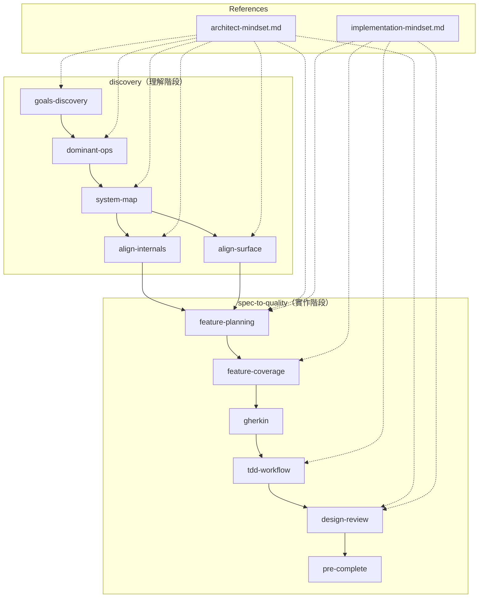

# insight-to-quality

一套 Claude Code skills，涵蓋從**架構理解到程式碼品質**的完整弧線——確保從「我們在蓋什麼？」到「蓋得對嗎？」之間不遺失資訊。

## 為什麼做這個

用 Claude Code 開發時，我遇到兩類問題：

**理解問題**（寫 code 之前）：
- 還沒理解系統壓力在哪就跳進實作
- 多 agent 開發時容易迷失目標跟設計決策
- 技術選擇基於習慣而非追溯到約束條件

**實作問題**（寫 code 時）：
- Spec 到測試的覆蓋率缺口、mock 邊界畫錯、跨元件資料形狀對不上
- 測試過了但設計品質很差
- 說「完成了」但其實沒跑過 lint 或 type check

### 核心觀點

**Bad research 會衍生出更多 bad plans，而一個 bad plan 可以衍生出大量的 bad code。**

如果一開始就沒搞清楚系統的目標和壓力在哪，後面的每一個 spec 都可能在錯誤的方向上寫得很精確。修正一個 spec 的成本是可控的，但如果 10 個 spec 全都基於錯誤的前提，回頭成本會爆炸性增長。

所以 `discovery` 存在的目的就是：**在寫任何 spec 之前，先用結構化的方式把理解做對。** 而 `spec-to-quality` 則確保理解正確之後，實作過程不走樣。

## 讓這套流程真正發揮作用

這套 plugin 提供結構，但**內容來自真實的互動**。這個差別決定了你能從中得到多少。

### 架構給的是什麼

每個 skill 強制產出特定形狀的文件——有 ID 的 goals、有 Criticality score 的 dominant ops、有 Checkpoint A/B 的 Verification Ledger。這些格式讓 downstream 文件可以引用 upstream 的結論（Gx → Dx → APx → Feature Plan → Ledger），形成可追溯的鏈。

**這個鏈是真實的：** 如果你在 goals-discovery 認真思考了非目標，feature-planning 的 error taxonomy 就會更精確；如果 dominant-ops 的 failure impact 分析是真實的，tdd-workflow 的 mock 邊界就會畫在對的地方。文件之間的連結是互相影響的，不是裝飾性 ID。

### 什麼樣的互動能放大效果

- **你比 agent 更了解你的領域。** 當 agent 問「這個操作失敗會怎樣？」，你的答案（「使用者不會知道資料掉了」vs「整個流程需要重跑」）直接決定 D1 的 failure impact 分析準不準確。
- **Push back 比附和更有價值。** 當 agent 提出一個 goal 或 seam，你說「這個不對，因為...」比說「聽起來不錯」產生更多洞見。
- **「我不知道」是有效的答案。** Theory Limits 的估計值可以標 `[estimate]`，Open Questions 可以是真的未決定——承認不確定比假裝確定更有用。

### Plugin 抓不到什麼

Skills 驗證的是**輸出形狀**，不是**推理品質**。一個 agent 可以填滿 Theory Limits 表格而沒有真正想過 binding constraint 是什麼，可以寫出 AP1 (protects D1) 而沒有真的問過哪種設計會讓 D1 靜默失敗。

如果互動是機械性的——使用者隨意回應、agent 快速填格——文件看起來完整，但裡面沒有真實的 insight。這不是這套 plugin 能解決的問題。

### 唯一的結構性缺口

**沒有 backward path。** 如果做到 align-internals 才發現某個 seam 畫錯了，或做到 tdd-workflow 才發現 .feature 的 Given 不合理——要退回去更新前面的文件，目前沒有定義好的 protocol。遇到這種情況，按照 Discovery Conflict Triage 的層級往上找到源頭，從那裡往下重新走一遍。

## 完整流程



### discovery — 架構理解

5 個 skills，從「這系統是什麼？」引導到「內部跟介面有沒有對齊真正重要的東西？」

| Skill | 做什麼 |
|-------|--------|
| **goals-discovery** | 定義系統目標、非目標、NFR 跟約束條件 |
| **dominant-ops** | 找出壓力所在（頻率 x 代價 x 失敗影響） |
| **system-map** | 建立導航地圖：Component Map、Boundary Map、Change Protocol |
| **align-internals** | 設計或驗證 contracts 與 persistence 的對齊 |
| **align-surface** | 設計或驗證使用者介面與基礎設施的對齊 |

align 系列支援兩種模式：**設計模式**（沒有現成 code，引導設計）和**驗證模式**（有現成 code，審計對齊狀況）。

#### SYSTEM_MAP 的設計目的

SYSTEM_MAP.md 不只是一份架構文件——它是**多 agent 協作和多視窗開發時的共享地圖**。

在實際開發中，不管是多個 Claude Code agent 同時工作，還是開發者自己開多個 context window 處理不同功能，最常遇到的問題是：「我改了 A，會不會影響 B？」「這個 spec 應該動到哪些檔案？」。如果每次都要重新理解一遍架構，效率會非常低。

SYSTEM_MAP 的 **Change Protocol** 就是為了解決這個問題——它按照影響範圍分成四種 type，讓任何 agent 或開發者在動手前就知道需要碰哪些東西。這讓平行開發時每個人（或 agent）都能獨立判斷自己的改動範圍，而不是靠「問一下別人」或「全部看一遍」。

### spec-to-quality — 實作品質

5 個 skills，強制穩定的 TDD 工作流程從 spec 到完成。

| Skill | 做什麼 |
|-------|--------|
| **feature-coverage** | 寫 .feature 前，強制分析 6 類 scenario 覆蓋率 |
| **gherkin** | 照覆蓋率分析結果寫 .feature |
| **tdd-workflow** | Verification Ledger + 嚴格 Red-Green-Refactor |
| **design-review** | 綠燈後的設計品質審查，用提問引導 |
| **pre-complete** | 最終關卡：測試 + lint + type check + delta spec 同步 |

## 交接：discovery 到 spec-to-quality

Discovery 產出三份核心文件，加上兩次對齊驗證，形成完整的交接：

### 核心文件

| 文件 | 產出者 | 消費者 |
|------|--------|--------|
| `goals.md` | goals-discovery | 所有下游 skill 的可追溯性根源 |
| `dominant-ops.md` | dominant-ops | tdd-workflow（anti-patterns 影響 mock 邊界）、align skills（Dx 優先序） |
| `SYSTEM_MAP.md` | system-map | Change Protocol 指導所有實作決策、多 agent 協作的共享地圖 |

### 對齊驗證

| 對齊類型 | 驗證者 | 確認什麼 |
|----------|--------|----------|
| 內部對齊 | align-internals | 每個 seam 有 contract、每個 goal 有 persistence、Dx 路徑上的 contract 品質足夠 |
| 表面對齊 | align-surface | 每個 Dx 的 user journey 有對應介面、endpoint 分類正確、基礎設施容量足以承受壓力 |

### 橋接：feature-planning

對齊完成後，`feature-planning` 負責決定下一個要實作什麼：

1. 讀取 SYSTEM_MAP 的 gaps 和 Lessons，交叉比對既有 feature plans
2. 選定 feature 後，引導 Error Handling Strategy 的三個決策
3. 產出 `docs/feature-plans/{feature-name}.md`，鎖定 anti-patterns 和 boundary rules

Feature plan 完成後，才進入 `feature-coverage` 開始寫測試規格。SYSTEM_MAP.md 裡的 Change Protocol 會告訴你這是什麼類型的變動、需要動到哪些地方。

## 開發情境

不同情境走不同路徑——不是每件事都需要從頭跑完整個流程。

| 情境 | 起點 | 路徑 |
|------|------|------|
| **全新專案** | 沒有任何 discovery 文件 | 完整 discovery（goals → dominant-ops → system-map → align）→ feature-planning → 完整實作流程 |
| **舊專案接手** | 有 code 但沒有文件 | 考古（掃描 codebase）→ 安全網（characterization tests）→ discovery（用驗證模式）→ 漸進重構 |
| **正常開發** | Discovery 完成，開始下一個 feature | feature-planning → feature-coverage → gherkin → tdd-workflow → design-review → pre-complete |
| **小改動（不影響契約）** | 內部實作調整，boundary 不變 | OpenSpec → tdd-workflow → pre-complete |
| **Bug fix** | 測試失敗或非預期行為 | 系統化除錯：收集證據 → 建立假說 → 驗證，不猜測性修改 |
| **實作中發現問題** | 實作到一半撞牆 | 用 Discovery Conflict Triage（implementation-mindset.md）判斷影響層級，從對應層級往下修 |

### Discovery Conflict Triage 簡要

實作過程中遇到衝突時，依影響範圍決定從哪裡開始修：

- **Level 0**（只改 code）：不影響測試 → 直接改
- **Level 1**（改 spec 實作）：不影響契約 → 從 OpenSpec 往下
- **Level 2**（改契約/邊界）：影響跨 boundary 的資料形狀 → 從 SYSTEM_MAP 往下
- **Level 3**（改 goal/dominant-op）：系統目的或壓力排序有誤 → 從 discovery 源頭往下

詳細判斷流程見 `references/implementation-mindset.md` 的 Discovery Conflict Triage 段落。

## 安裝

```bash
# 加入 marketplace
/plugin marketplace add class83108/insight-to-quality

# 安裝 plugin
/plugin install insight-to-quality
```

## 你的專案需要準備什麼

在專案的 `CLAUDE.md` 裡面要有一個 **Commands** 區段，告訴 agent 怎麼跑測試、lint、type check。Skills 不會假設任何特定工具。

參考 [templates/CLAUDE.md.example](templates/CLAUDE.md.example) 看範例。

### 建議的工具組合

- **OpenSpec** — 需求與變更管理
- **uv** — 套件管理
- **pytest + pytest-bdd** — 測試
- **ruff** — lint & format
- **pyright** — 型別檢查

## 關於迭代

這是我個人開發流程的產物——把「我開發時怎麼想、怎麼檢查」自動化成 skills。會隨著日常使用的感受持續進化。

- Eval workspace 放在 repo 裡，方便追蹤每次改動的前後對比
- 如果某個步驟出現更好的工具，skill 會跟著更新

版本歷史見 [CHANGELOG.md](CHANGELOG.md)。
