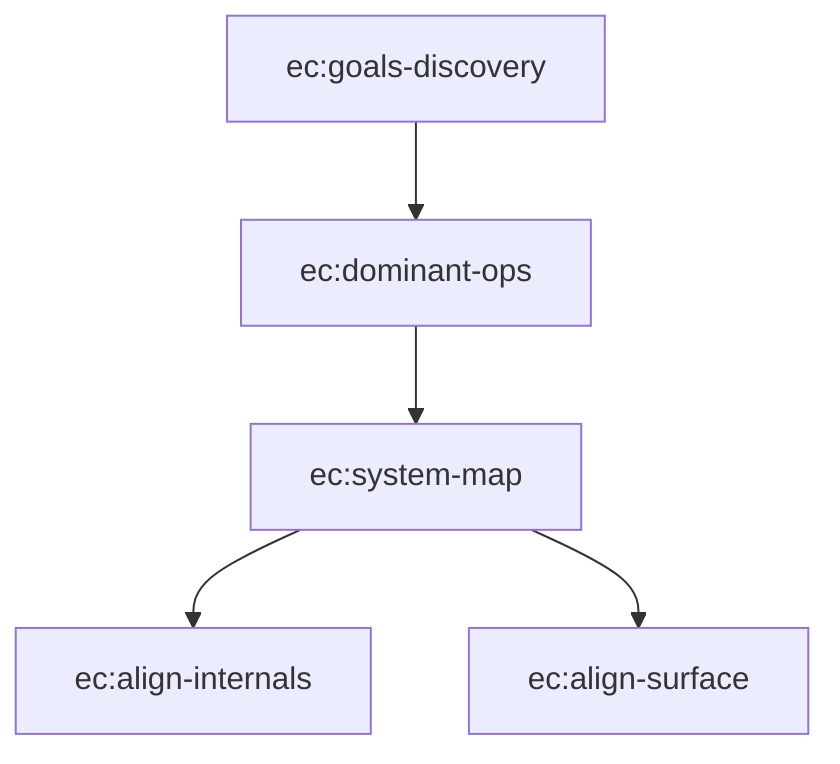

# discovery — Agent Guide

這套 skills 實現「從洞察到理解」的架構探索流程。目標是在寫任何 spec 或 code 之前，用結構化的方式把系統理解做對。

## 核心信念

Bad research 衍生 bad plans，bad plans 衍生 bad code。這套 skills 的存在就是為了確保 research 階段的品質。

## Skill 執行順序

## 規則

- **按順序執行**：每個 skill 有前置條件（需要哪些文件存在），必須滿足才能進入下一個
- **引導而非代寫**：discovery 是引導使用者思考，不是 agent 自己寫完。所有文件都需要使用者確認
- **三份核心文件**：goals.md（要什麼）、dominant-ops.md（壓力在哪）、SYSTEM_MAP.md（東西在哪、改了會怎樣）
- **align skills 有雙模式**：先問使用者是設計模式（沒有 code）還是驗證模式（有 code），行為完全不同
- **SKILL.md 和 references 用英文撰寫**

## Skill 銜接說明

| 從 | 到 | 銜接方式 |
|----|-----|---------|
| ec:goals-discovery | ec:dominant-ops | goals.md 確認後，以 Gx ID 作為 traceability 起點 |
| ec:dominant-ops | ec:system-map | dominant-ops.md 確認後，Dx + Anti-Patterns 驅動邊界設計 |
| ec:system-map | ec:align-internals | SYSTEM_MAP 的 Boundary Map 驅動 contract 對齊 |
| ec:system-map | ec:align-surface | SYSTEM_MAP 的 Component Map + Dx user journey 驅動介面對齊 |
| ec:align-internals/surface | spec-to-quality | 對齊完成後，交接給 ec:feature-coverage 開始實作 |

## 共享 Reference

所有 skills 共用 `shared/references/architect-mindset.md`，包含：
- 抽象邊界三測試（判斷邊界畫得對不對）
- 文件層級 = 抽象層級（判斷細節該寫在哪裡）
- Dominant Operations 思維（頻率 x 代價 x 失敗影響）
- Traceability（Goal -> Dominant Op -> Boundary -> Implementation）

每個 SKILL.md 開頭都要求先讀這份 reference。

## 前置要求

此 plugin 不假設任何特定技術棧。它適用於任何需要結構化架構理解的軟體專案。

## 與 spec-to-quality 的交接

Discovery 完成後（5 個 skills 都走完），產出物為：

1. **goals.md** — spec-to-quality 的 ec:feature-coverage 用來確保 scenario 覆蓋所有 goals
2. **dominant-ops.md** — ec:tdd-workflow 的 Verification Ledger 用 anti-patterns 來校準 mock 邊界
3. **SYSTEM_MAP.md** — Change Protocol 指導每個 OpenSpec change 的影響範圍判斷
4. **Internals Alignment Report**（如果有）— 標記 contract/persistence 的缺口，影響 spec 優先序
5. **Surface Alignment Report**（如果有）— 標記介面/基礎設施缺口，可能產生新的 spec

交接點是 `ec:feature-coverage`——discovery 結束，implementation 開始。
