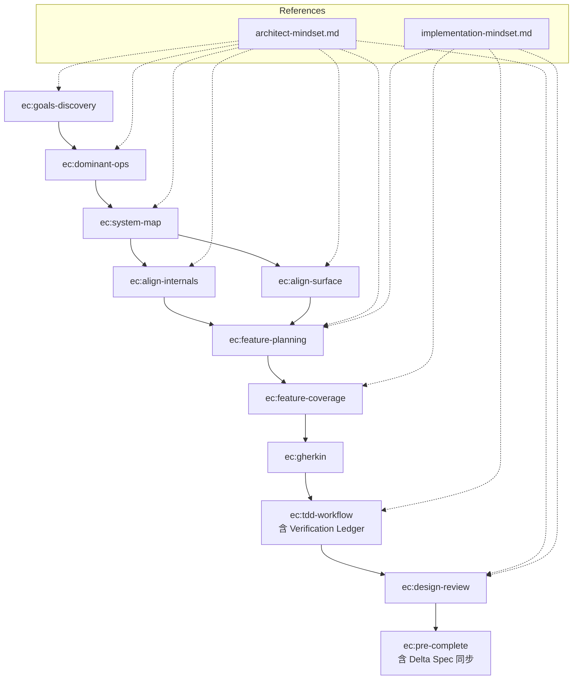

# insight-to-quality — Agent Guide

這套 skills 實現完整的「從洞察到品質」開發流程：結構化 discovery → feature planning → TDD 實作 → 設計驗證。

## 核心信念

Bad research 衍生 bad plans，bad plans 衍生 bad code。Discovery 確保研究品質；實作 skills 確保實作品質。沒有 discovery 就開始實作等同於 vibe coding——遇到缺少 discovery 文件時，引導使用者先完成 discovery。

## 完整流程



## 規則

- **按順序執行**：每個 skill 有前置條件，必須滿足才能進入下一個
- **Discovery 是前提**：沒有 goals.md、dominant-ops.md、SYSTEM_MAP.md 就進入實作，ec:feature-planning 會擋下並要求先完成 discovery
- **引導而非代寫**：discovery 階段引導使用者思考，所有文件都需要使用者確認
- **Align skills 有雙模式**：先問使用者是設計模式（沒有 code）還是驗證模式（有 code）——設計模式產出的不一定是 .md 文件，可能是合約設計、schema、介面規格或基礎設施決定；驗證模式產出 alignment report，標記缺口
- **一個 spec 完整走完再做下一個**：從 ec:feature-planning → ec:pre-complete 全部走完後，再開始下一個 spec
- **測試/lint/type check 命令**：一律參照專案 CLAUDE.md 的 Commands 區段，不要假設任何特定工具
- **等待使用者確認**：ec:feature-coverage 分析完、ec:tdd-workflow Verification Ledger 確認、紅燈確認，都需要使用者明確同意才能繼續
- **Gherkin 關鍵字英文、內容中文**：Feature/Scenario/Given/When/Then 等關鍵字一律英文，步驟描述與名稱使用繁體中文
- **分支策略**：開始實作前，應詢問使用者是否要開新分支。不要直接在 main 分支上開發功能

## Skill 銜接說明

| 從 | 到 | 銜接方式 |
|----|-----|---------|
| ec:goals-discovery | ec:dominant-ops | goals.md 確認後，以 Gx ID 作為 traceability 起點 |
| ec:dominant-ops | ec:system-map | dominant-ops.md 確認後，Dx + Anti-Patterns 驅動邊界設計 |
| ec:system-map | ec:align-internals | SYSTEM_MAP 的 Boundary Map 驅動 contract 對齊 |
| ec:system-map | ec:align-surface | SYSTEM_MAP 的 Component Map + Dx user journey 驅動介面對齊 |
| ec:align-internals/surface | ec:feature-planning | 對齊完成後，讀 SYSTEM_MAP gaps 決定下一個 feature |
| ec:feature-planning | ec:feature-coverage | feature plan 建立後進入覆蓋率分析 |
| ec:feature-coverage | ec:gherkin | 覆蓋率分析確認後，直接觸發 ec:gherkin skill 撰寫 .feature |
| ec:gherkin | ec:tdd-workflow | .feature 撰寫完成後，先做 Verification Ledger，確認後再進入 Red |
| ec:tdd-workflow | ec:design-review | 綠燈 + refactor 完成後，提醒可以觸發 ec:design-review |
| ec:design-review | ec:pre-complete | review 完成後，如果要 commit/PR，觸發 ec:pre-complete（含 delta spec 同步） |

## References

所有 skills 共用 `references/` 目錄，不需要客製化：

- **`references/architect-mindset.md`** — Discovery 與設計驗證使用：抽象邊界三測試、Dominant Operations 思維、Traceability
- **`references/implementation-mindset.md`** — Feature planning 與實作使用：Error Handling Strategy（Three Decisions）、Structural Checks、Feature Coverage Category definitions

## OpenSpec 交接約定

Discovery 完成後，每個 OpenSpec change 的 spec.md **body 最頂端**必須加一行：

```
**Serves:** G1, G3
```

對應 goals.md 的 Goal ID。沒有 `Serves:` 欄位的 change 等同於沒有 goal 根基，ec:feature-planning 和 ec:feature-coverage 會阻擋並要求補上。

**誰的責任**：執行 `opsx:apply` 建立 change 的那一刻，agent 應主動詢問「這個 change 服務哪個 goal？」並在 spec.md body 加上 `**Serves:** Gx`。

## Language Policy

All output documents (goals.md, dominant-ops.md, SYSTEM_MAP.md, feature plans, alignment
reports, Verification Ledgers, etc.) and user-facing communication must be in Traditional
Chinese (繁體中文), regardless of the language of these skill instructions.

Gherkin keywords remain English (Feature/Scenario/Given/When/Then/And/But/Background/
Scenario Outline/Examples) — step content and names follow the Traditional Chinese policy.

## 前置要求

此 plugin 假設專案的 CLAUDE.md 包含以下區段：

- **Commands**：定義測試、lint、format、type check 的具體命令
- **Feature Scenario 具體化對應表**（選用）：將 6 類通用 scenario 類別對應到專案特定概念

## 新專案提醒

如果專案使用 OpenSpec 但尚未初始化，在開始任何 spec 工作前提醒使用者執行 `openspec init`。判斷方式：專案中不存在 `openspec/` 目錄。
