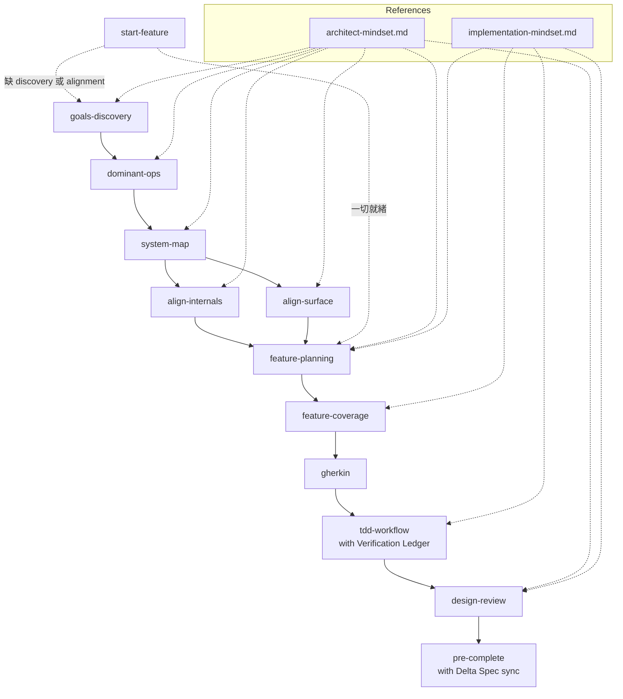

# insight-to-quality — Agent Guide

This set of skills implements a complete "from insight to quality" development workflow: structured discovery → feature planning → TDD implementation → design verification.

## Core Belief

Bad research produces bad plans; bad plans produce bad code. Discovery ensures research quality; implementation skills ensure implementation quality. Starting implementation without discovery is equivalent to vibe coding — when discovery documents are missing, guide the user to complete discovery first.

## Full Workflow



## Rules

- **Execute in order**: Each skill has prerequisites that must be satisfied before proceeding to the next
- **Discovery is a prerequisite**: Proceeding to implementation without goals.md, dominant-ops.md, and SYSTEM_MAP.md will cause feature-planning to block and require discovery first
- **Guide, don't write for the user**: The discovery phase guides the user's thinking; all documents require user confirmation
- **Align skills have dual modes**: First ask the user whether this is design mode (no existing code) or verification mode (code already exists) — design mode may produce contracts, schemas, interface specs, or infrastructure decisions rather than .md files; verification mode produces an alignment report that flags gaps
- **Complete one spec before starting the next**: Walk through feature-planning → pre-complete fully before starting another spec
- **Test/lint/type check commands**: Always refer to the project's CLAUDE.md Commands section; do not assume any specific tooling
- **Wait for user confirmation**: feature-coverage analysis, tdd-workflow Verification Ledger sign-off, and red-light confirmation all require explicit user approval before proceeding
- **Gherkin keywords in English, content in Traditional Chinese**: Feature/Scenario/Given/When/Then and other keywords are always English; step descriptions and names use Traditional Chinese
- **Branch strategy**: Before starting implementation, ask the user whether to create a new branch. Do not develop features directly on the main branch
- **Multi-agent parallel development**: Each agent owns an independent spec and follows the "complete one spec fully" rule. Specs that touch the same boundary should be serialized rather than parallelized to avoid contract conflicts

## Skill Handoff Reference

| From | To | Handoff |
|------|----|---------|
| goals-discovery | dominant-ops | After goals.md is confirmed, use Gx IDs as the traceability anchor |
| dominant-ops | system-map | After dominant-ops.md is confirmed, Dx + Anti-Patterns drive boundary design |
| system-map | align-internals | SYSTEM_MAP's Boundary Map drives contract alignment |
| system-map | align-surface | SYSTEM_MAP's Component Map + Dx user journeys drive interface alignment |
| align-internals/surface | feature-planning | After alignment, read SYSTEM_MAP gaps to decide the next feature |
| start-feature | goals-discovery / dominant-ops / system-map / align-internals / align-surface / feature-planning | Routes to the earliest layer that needs work; use when you have a feature idea but don't know the scope |
| feature-planning | feature-coverage | After the feature plan is established, proceed to coverage analysis |
| feature-coverage | gherkin | After coverage analysis is confirmed, trigger gherkin to write the .feature file |
| gherkin | tdd-workflow | After the .feature file is written, create the Verification Ledger first, then proceed to Red |
| tdd-workflow | design-review | After green + refactor, remind the user to trigger design-review |
| design-review | pre-complete | After review, trigger pre-complete (with delta spec sync) before commit/PR |

## References

All skills share the `references/` directory — no customization needed:

- **`references/architect-mindset.md`** — Used by discovery and design verification: Abstract Boundary Three Tests, Dominant Operations thinking, Traceability
- **`references/implementation-mindset.md`** — Used by feature planning and implementation: Error Handling Strategy (Three Decisions), Structural Checks, Feature Coverage Category definitions

## OpenSpec Handoff Convention

After discovery is complete, the **top of the body** of each OpenSpec change's spec.md must include a line:

```
**Serves:** G1, G3
```

mapping to the Goal IDs in goals.md. A change without a `Serves:` field has no goal foundation — feature-planning and feature-coverage will block it and require the field to be added.

**Whose responsibility**: At the moment `opsx:apply` is run to create a change, the agent should proactively ask "Which goal does this change serve?" and add `**Serves:** Gx` to the spec.md body.

## Language Policy

All output documents (goals.md, dominant-ops.md, SYSTEM_MAP.md, feature plans, alignment
reports, Verification Ledgers, etc.) and user-facing communication must be in Traditional
Chinese (繁體中文), regardless of the language of these skill instructions.

Gherkin keywords remain English (Feature/Scenario/Given/When/Then/And/But/Background/
Scenario Outline/Examples) — step content and names follow the Traditional Chinese policy.

## Prerequisites

This plugin assumes the project's CLAUDE.md contains the following sections:

- **Commands**: Defines the specific commands for testing, lint, format, and type checking
- **Feature Scenario Concrete Mapping Table** (optional): Maps the 6 generic scenario categories to project-specific concepts

## New Project Reminder

If the project uses OpenSpec but has not yet been initialized, remind the user to run `openspec init` before starting any spec work. Detection: the `openspec/` directory does not exist in the project.
