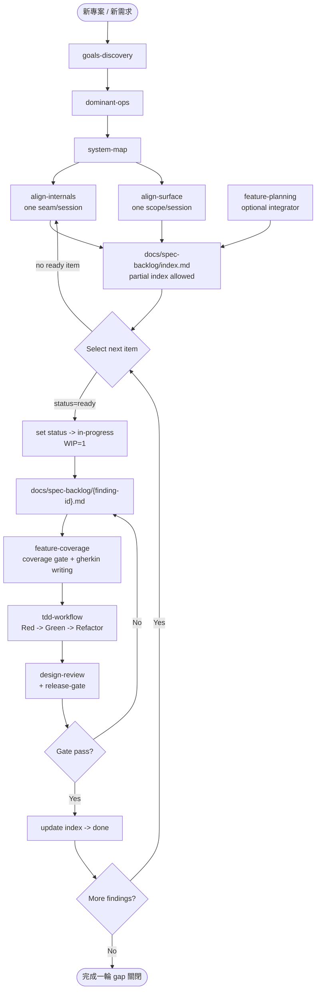

# insight-to-quality — Agent Guide

This set of skills implements a complete "from insight to quality" workflow:
structured discovery -> alignment -> spec backlog -> TDD implementation -> design verification.

## Core Belief

Bad research produces bad plans; bad plans produce bad code. Discovery ensures research quality; implementation skills ensure implementation quality. Starting implementation without discovery is equivalent to vibe coding — when discovery documents are missing, guide the user to complete discovery first.

## Full Workflow

## Rules

- **Execute in order**: Each skill has prerequisites that must be satisfied before proceeding to the next
- **Discovery is a prerequisite**: Proceeding to implementation without goals.md, dominant-ops.md, and SYSTEM_MAP.md will block and require discovery first
- **Guide, don't write for the user**: The discovery phase guides the user's thinking; all key decisions require user confirmation
- **Align skills have dual modes**: First ask design mode (no existing code) or verify mode (code exists)
- **Spec backlog is execution source**: `docs/spec-backlog/index.md` is the queue; `docs/spec-backlog/{finding-id}.md` is the single implementation spec
- **WIP=1**: Only one finding may be `in-progress` at a time; multiple `draft/ready` items are allowed
- **Partial index is allowed**: First pass can be one boundary/journey slice; do not block execution waiting for full inventory
- **Test/lint/type check commands**: Always refer to project's CLAUDE.md Commands section
- **Wait for user confirmation**: spec-to-gherkin coverage confirmation and tdd-workflow red confirmation require explicit approval
- **Gherkin keywords in English, content in Traditional Chinese**
- **Branch strategy**: Before implementation, ask whether to create a new branch; do not develop directly on main

## Skill Handoff Reference

| From | To | Handoff |
|------|----|---------|
| goals-discovery | dominant-ops | After goals.md is confirmed, use Gx IDs as traceability anchors |
| dominant-ops | system-map | After dominant-ops.md is confirmed, Dx + Anti-Patterns drive boundary design |
| system-map | align-internals | SYSTEM_MAP Boundary Map drives contract alignment |
| system-map | align-surface | SYSTEM_MAP Component Map + Dx journeys drive interface alignment |
| align-internals/surface | spec-backlog | Produce/refresh index rows and finding cards from verified gaps |
| start-feature | goals-discovery / dominant-ops / system-map / align-internals / align-surface / spec-backlog | Route to earliest missing layer; if ready, enter spec-backlog execution |
| spec-backlog card | feature-coverage | Convert one finding card into coverage table and .feature scenarios |
| feature-coverage | tdd-workflow | After coverage confirmed and .feature written, create Verification Ledger and enter Red |
| tdd-workflow | design-review | After green + refactor, run design review and release-gate checks |

## Spec Backlog Conventions

### 1) Index file

Path: `docs/spec-backlog/index.md`

| finding-id | slice | source | serves | related | boundary | priority | status | deps |
|---|---|---|---|---|---|---|---|---|

- `source`: internals / surface / both
- `status`: draft / ready / in-progress / done
- `serves`: Gx IDs (`G1,G3`)
- `related`: Dx/APx IDs (`D1,AP2`)

### 2) Finding card

Path: `docs/spec-backlog/{finding-id}.md`

Required fields:
- Source finding and report link
- Serves (Gx)
- Related pressure (Dx/APx)
- Boundary
- Behavior (SHALL/MUST)
- Error Handling Strategy (catch boundary, domain errors, infrastructure recovery)
- Done Criteria (testable)
- Out of Scope
- Integration Test Gaps (optional, updated after ledger)

### 3) State transition

- `draft -> ready`: scoped and reviewable
- `ready -> in-progress`: execution starts; create finding card if missing
- `in-progress -> done`: after TDD green + design-review/release-gate pass

## References

All skills share `references/`:

- `references/architect-mindset.md` — discovery and design verification
- `references/implementation-mindset.md` — error strategy, structure checks, coverage categories

## Language Policy

All output documents (goals.md, dominant-ops.md, SYSTEM_MAP.md, alignment reports,
spec backlog files, verification ledgers, etc.) and user-facing communication must be in
Traditional Chinese (繁體中文).

Gherkin keywords remain English (Feature/Scenario/Given/When/Then/And/But/Background/Scenario Outline/Examples).

## Prerequisites

This plugin assumes project's CLAUDE.md contains:

- **Commands**: test/lint/format/type-check commands
- **Feature Scenario Concrete Mapping Table** (optional)
