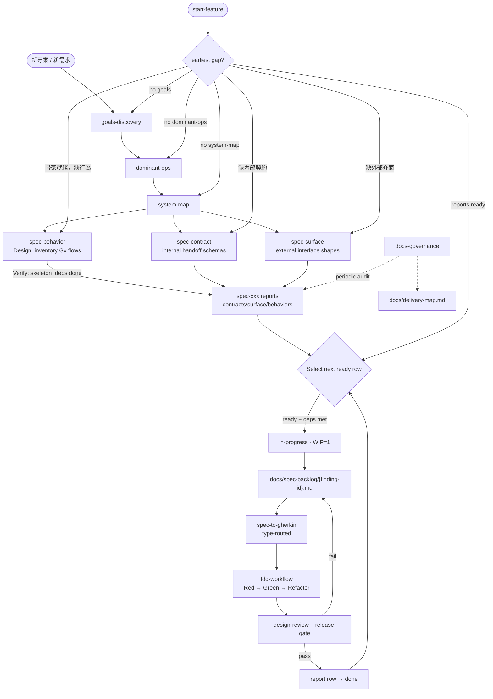

# insight-to-quality — Agent Guide

Structured discovery → spec-xxx alignment (contract/surface/behavior) → finding execution → TDD → design verification.

## Core Belief

Bad research produces bad plans; bad plans produce bad code. When discovery documents are missing, guide the user to complete discovery first — no exceptions.

## Skeleton vs. Feature

| Layer | Definition | Produced by |
|-------|-----------|-------------|
| **Skeleton** | Data contracts, schemas, boundary guards | spec-contract / spec-surface |
| **Feature** | Functional logic, user journeys, business behavior | spec-behavior |

Skeleton first — it defines the growth boundary for features. In existing systems alignment mostly finds missing skeleton; in greenfield systems spec-behavior fills the gap for Gx functional implementation.

## Full Workflow

## Cross-cutting Rules

- **Discovery is prerequisite**: goals.md + dominant-ops.md + SYSTEM_MAP.md before alignment
- **Skeleton before feature**: spec-behavior Verify only when slice's `skeleton_deps` are done
- **Infrastructure → SYSTEM_MAP**: infrastructure gaps escalate to SYSTEM_MAP update, not finding cards
- **WIP=1**: one `in-progress` finding at a time
- **Report-row status source**: active status is maintained in contracts/surface/behaviors report rows
- **Wait for user confirmation**: spec-to-gherkin confirmation gate before writing `.feature`
- **Gherkin keywords English, content 繁體中文**
- **Branch strategy**: ask before creating; never develop on main
- **Test/lint/type check**: refer to project's CLAUDE.md Commands section
- **Default path**: spec-to-gherkin includes coverage + writing; `gherkin`/`pre-complete` only on explicit request

## Skill Handoff Reference

| From | To | Handoff |
|------|----|---------|
| goals-discovery | dominant-ops | goals.md confirmed → Gx as traceability anchors |
| dominant-ops | system-map | Dx + Design Implications + Anti-Patterns → boundary design + tech stack |
| system-map | spec-contract | Boundary Map → internal handoff alignment |
| system-map | spec-surface | Component Map + Dx journeys → external interface alignment |
| system-map | spec-behavior | SYSTEM_MAP + goals + skeleton reports → behavior gap analysis |
| spec-contract / spec-surface | report rows + finding cards | skeleton finding cards + report-row status sync |
| spec-behavior | report rows + finding cards | feature finding cards + report-row status sync |
| start-feature | earliest missing layer | Route to discovery / spec-xxx as needed |
| spec-backlog card | spec-to-gherkin | type-routed coverage + .feature |
| spec-to-gherkin | tdd-workflow | coverage confirmed + .feature written → Red |
| tdd-workflow | design-review | green + refactor → review + release-gate |
| design-review | docs-governance | optional sparse governance audit |

## Finding Card Routing

| finding-id prefix | type | Gherkin Guide | Test Path |
|-------------------|------|---------------|-----------|
| `contract-*` | skeleton | contract-gherkin-guide | `tests/features/contracts/` |
| `surface-*` | skeleton | surface-gherkin-guide | `tests/features/contracts/` |
| `behavior-*` | feature | feature-gherkin-guide | `tests/features/behaviors/` |

spec-to-gherkin reads `type` + prefix → auto-selects guide and path.

## Language Policy

All output documents and user-facing communication: **繁體中文**.
Gherkin keywords: **English** (Feature/Scenario/Given/When/Then/And/But/Background/Scenario Outline/Examples).

## Prerequisites

Project's CLAUDE.md must contain:

- **Commands**: test/lint/format/type-check commands
- **Feature Scenario Concrete Mapping Table** (optional)
