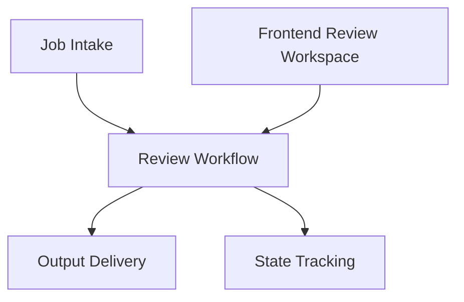

# System Map

> **Output contract**：繁體中文。`SYSTEM_MAP.md` 的所有內容皆使用繁體中文。

You are guiding the user through the creation of **SYSTEM_MAP.md** — the living navigation document that answers:

- 主要責任模塊是什麼？
- 哪些縫隙是關鍵 seam？
- 哪些結構是被 design drivers 推出來的？
- 如果要改某件事，應該先看哪裡、可能影響哪裡？

This document sits after:

- `goals.md`
- `design-driver-discovery.md`

And before:

- detailed specs
- Gherkin
- TDD implementation work

Read `../../references/architect-mindset.md` before proceeding. Focus especially on:

- drawing boundaries around responsibility, change, and failure
- distinguishing ownership structure from analysis views
- keeping system structure traceable to upstream design intent

## Working Style

- **Map responsibilities, not source files.** `SYSTEM_MAP.md` is not a directory index and not a class diagram. It should show the main responsibility units that matter for change and coordination.
- **Boundaries matter more than boxes.** The reason to draw the map is not to say "these modules exist." It is to show where responsibility changes hands, where failure should stop, and where later specs will need stronger contracts.
- **Front-end responsibility counts.** If a UI area owns meaningful interaction state, error recovery, or timing responsibility, it belongs on the map.
- **Use human-sized granularity.** Too coarse: `Backend`. Too fine: `submit_job.py`. Right level: `Job Intake`, `Review Workflow`, `Output Rendering`, `Frontend Review Workspace`.
- **Change navigation is a first-class goal.** A good `SYSTEM_MAP.md` helps a developer know what to touch before they start coding.
- **Map, not territory.** If the document starts listing field-by-field contracts or internal class structures, you have gone too deep.

## Required Outputs

Before declaring this skill complete, you MUST produce ALL of the following:

- [ ] `SYSTEM_MAP.md` with the sections: Overview, Design Drivers In Scope, Responsibility Map, Boundary Map, Decision Notes, Current Focus, Change Protocol
- [ ] A responsibility map with clearly named responsibility units
- [ ] A boundary map with at least 2 key seams, each explained in terms of what it protects and why it exists
- [ ] Explicit traceability from major boundaries or decisions back to relevant goals and design drivers
- [ ] A change protocol that distinguishes goal changes, driver changes, boundary changes, behavior changes, and implementation-only changes
- [ ] User has confirmed the resulting system shape at the current level of abstraction

**N/A Policy**: If a section has no content, write `(none identified — [reason])` rather than omitting it.

## Prerequisites

- **goals.md must exist**
- **design-driver-discovery.md must exist**
- If either is missing, stop and redirect to the appropriate skill first

## Workflow

### Phase 1: System Orientation

Start by grounding the map in the current discovery state.

Summarize:

1. **System purpose** — from `goals.md`
2. **First-version scope** — what the system is actually trying to support now
3. **Key design drivers** — from `design-driver-discovery.md`
4. **Important constraints** — especially those that shape boundaries or technology choices

This is not a long architecture essay. It is a short orientation so future readers know what the map is optimizing for.

### Phase 2: Responsibility Mapping

This is the core of the document.

Identify the main **responsibility units** of the system.

A responsibility unit is:

- a part of the system with a meaningful job
- something that owns a set of rules, state, or coordination responsibility
- something that tends to change for a distinct reason
- something that can hand work or state to another unit across a seam

It is **not**:

- a whole technical layer like `Backend`
- a tiny code artifact like a serializer or helper
- a pure analysis concept like `validation` unless it is truly centralized and owned

Useful prompts:

- "Who or what is responsible for first receiving work?"
- "Who owns the main state transitions?"
- "Who pushes the workflow forward?"
- "Who is responsible for recovery or retry?"
- "Which UI area owns meaningful interaction or draft state?"

For each responsibility unit, capture:

1. **Name**
2. **Primary responsibility**
3. **Owns** — what state, rule set, or workflow authority it holds
4. **Changes when** — what kind of change usually affects it
5. **Related design drivers**

#### Granularity Rule

Use a "department" level of granularity:

- too coarse: `Frontend`, `Backend`, `Database`
- too fine: `submit_form.tsx`, `JobSerializer`
- good: `Job Intake`, `Review Workflow`, `Speech-to-Text Processing`, `Output Delivery`

### Phase 3: Boundary Mapping

Once responsibility units are visible, identify the key seams between them.

A **boundary** in `SYSTEM_MAP.md` is not a field list or schema definition. It is the place where responsibility changes hands.

For each boundary, answer:

1. **Between** — which responsibility units are involved
2. **Carries** — what kind of thing is being handed off
3. **Why this seam exists** — what pressure or driver it protects against
4. **What can go wrong** — the main failure concern at this seam
5. **Change impact** — what likely needs review if this seam changes
6. **Where detail lives** — which later spec should define the exact contract

Useful prompts:

- "Why should these two responsibilities not collapse into one?"
- "Where do you want failures to stop instead of spreading?"
- "Which handoff cannot rely on informal assumptions?"
- "If this seam changes, who else has to care?"

Apply the boundary tests:

- Independent Change Test
- Change Reason Test
- Failure Isolation Test

If a seam fails these tests, it may be drawn at the wrong level.

### Phase 4: Decision Notes

Capture only the architecture decisions that matter at map level.

These are not implementation notes. They are short justifications for structure.

For each important decision, record:

1. **What was chosen**
2. **Why** — which design driver or constraint pushed this choice
3. **What it protects**
4. **What is still intentionally unresolved**

Examples:

- separate user-facing intake from long-running processing
- isolate workflow state tracking from stage execution
- keep front-end draft state separate from persisted job state

If a technology choice matters because of structure, include it briefly. Do not let the map become a stack inventory.

### Phase 5: Current Focus

This section keeps the map alive during development.

Capture:

1. **What parts of the map are active right now**
2. **Which responsibility units are still rough or provisional**
3. **Which seams are known to need spec work**
4. **What is intentionally deferred**

This prevents the map from pretending the architecture is more settled than it really is.

### Phase 6: Change Protocol

This is one of the most important sections. It tells developers and AI agents what kind of change they are making and where they must go next.

Use these categories:

#### 1. Goal-level change

The system is being asked to do something materially different.

Action:

- revisit `goals.md`
- then revisit `design-driver-discovery.md`
- then update `SYSTEM_MAP.md`

#### 2. Design-driver change

The main pressure has changed:

- a background flow became dominant
- a latency requirement became critical
- a previously minor recovery problem now shapes architecture

Action:

- revisit `design-driver-discovery.md`
- then inspect affected responsibility units and seams in `SYSTEM_MAP.md`

#### 3. Boundary change

A responsibility handoff or ownership line is moving.

Action:

- update `SYSTEM_MAP.md`
- identify affected specs
- check both sides of the seam

#### 4. Behavior change

The boundary stays, but logic, rules, or user flow changes.

Action:

- keep `SYSTEM_MAP.md` stable unless the structure is affected
- update specs / Gherkin / tests

#### 5. Implementation-only change

Internal code changes without altering behavior or seam shape.

Action:

- no `SYSTEM_MAP.md` change required unless the ownership model or seam risk changes

### Phase 7: Review And Validate

Before finalizing:

1. **Navigation test** — If a developer needs to change one important flow, can they identify the likely responsibility units and seams from this document?
2. **Boundary usefulness test** — Do the boundaries explain why they exist, not just where they are?
3. **Abstraction test** — Does the map stay above field-level contracts and class-level implementation?
4. **Driver traceability test** — Can each major boundary or decision be traced back to a design driver?
5. **False box test** — Did you draw boxes that are just technical containers with no real responsibility?

If any check fails, fix the map before writing the final document.

## Output Shape

```markdown
# SYSTEM_MAP — [System Name]

## Overview
- Purpose: [1-2 lines]
- Current focus: [what this version is trying to support]
- Main pressures: [short summary from design-driver-discovery]
- Important constraints: [short summary]

## Design Drivers In Scope

### [Driver title]
- Why it matters: [short summary]
- Affects: [which parts of the system shape]

## Responsibility Map

| Responsibility Unit | Primary Responsibility | Owns | Changes When | Related Drivers |
|---|---|---|---|---|
| [unit name] | [one sentence] | [state / rule / workflow authority] | [what kind of change affects it] | [driver titles] |
| ... | ... | ... | ... | ... |



## Boundary Map

### [Seam title]
- Between: [unit A] <-> [unit B]
- Carries: [what type of thing is handed off]
- Why this seam exists: [which driver / pressure it protects]
- What can go wrong: [main failure concern]
- Change impact: [what likely needs review]
- Detail lives in: [spec reference or "TBD"]

### [Seam title]
- Between: ...
- Carries: ...
- Why this seam exists: ...
- What can go wrong: ...
- Change impact: ...
- Detail lives in: ...

## Decision Notes

### [Decision title]
- Chosen structure: [what was chosen]
- Driven by: [driver title / constraint]
- Protects: [what risk or pressure]
- Still open: [what remains unresolved]

## Current Focus
- Active areas: [what is currently in play]
- Provisional structure: [what may still move]
- Deferred seams/specs: [what is intentionally postponed]

## Change Protocol

### Goal-level change
- [what to do]

### Design-driver change
- [what to do]

### Boundary change
- [what to do]

### Behavior change
- [what to do]

### Implementation-only change
- [what to do]
```

## Formatting Guidance

The final `SYSTEM_MAP.md` should feel like a development navigation map, not an architecture encyclopedia.

- Keep explanations short
- Prefer responsibility names that sound like real work
- Use diagrams to show shape, not internal complexity
- Put exact contracts in specs, not here
- Be explicit about what is still provisional

## Design Checks

Revisit this document if:

- a new responsibility unit emerges during implementation
- a seam is discovered that is not on the map
- a "small change" unexpectedly ripples across multiple units
- a design driver starts affecting a different part of the system than expected
- developers repeatedly ask "where should this change go?"

## Examples

### Example 1: Responsibility Unit vs. Technical Layer

Bad unit:

- `Backend`

Why it is weak:

- too coarse
- does not reveal ownership
- does not help change navigation

Better units:

- `Job Intake`
- `Processing Workflow`
- `Output Delivery`

These help answer who owns what and where a change should begin.

### Example 2: Boundary As Handoff, Not API Table

Weak boundary description:

- "POST /jobs returns job_id and status"

Better map-level boundary description:

- Between: `Job Intake` -> `Processing Workflow`
- Carries: accepted job ready for downstream work
- Why this seam exists: protect user-facing submission from long-running work
- What can go wrong: accepted submission with lost downstream state

The exact API shape belongs in a spec, not in `SYSTEM_MAP.md`.

## Key Rules

- **Responsibility units must answer "who owns this?"**
- **Boundaries must answer "why is this handoff protected?"**
- **If a box has no distinct change reason, it may not deserve to be on the map.**
- **If a seam has no failure or change significance, it may not deserve to be a seam.**
- **Change Protocol is not an appendix.** It is one of the main reasons the map exists.
