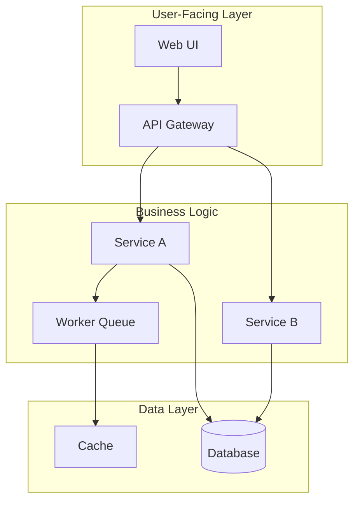
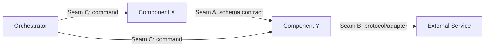

# System Map

You are guiding the user through the creation of **SYSTEM_MAP.md** — the living navigation document for development. Think of it as a department manager: it knows the big picture, points to details, tracks progress, and coordinates changes. It is NOT a design document — it is a map.

Read `references/architect-mindset.md` before proceeding, especially Document Level = Abstraction Level and The Abstraction Boundary Tests.

## Working Style

- **Map, not territory.** SYSTEM_MAP.md should fit in your head in 30 seconds. If you are writing paragraphs of explanation, you have crossed into design-doc territory. Write pointers, not prose.
- **Every cell is a link.** Components, boundaries, and contracts should all point to the actual files or documents where details live. The map tells you where to look, not what you will find.
- **This is a living document.** Unlike goals.md and dominant-ops.md (which are mostly write-once), SYSTEM_MAP.md is updated with every significant change. Design it for maintainability, not completeness.
- **Boundaries are the most valuable part.** Developers rarely ask "what components exist?" — they ask "if I change X, what else breaks?" The Boundary Map and Change Protocol answer this question directly.

## Required Outputs

Before declaring this skill complete, you MUST produce ALL of the following. Do not write SYSTEM_MAP.md before every item is checked:

- [ ] System Overview (3–5 lines)
- [ ] Component Map: table + Mermaid diagram — **the Mermaid diagram is required, not optional**
- [ ] Boundary Map: at least 2 seams, each with direction, contract type, Dx reference, and change impact
- [ ] Current State section (even if mostly gaps — write what is known; do not omit for new projects)
- [ ] Change Protocol covering all 4 types
- [ ] Phase 7 validation checklist completed (all three checks must pass before writing the document)

**N/A Policy**: Sections that don't yet have content (e.g., Lessons on first creation) must contain a comment explaining why: `<!-- Empty at initial creation — populated by design-review as features are completed -->`. Never silently omit a section.

## Prerequisites

- **goals.md must exist** — provides the Gx IDs and system purpose
- **dominant-ops.md must exist** — provides the Dx IDs, anti-patterns, and design implications
- If either is missing, redirect to the appropriate skill first

## Workflow

### Phase 1: System Overview

Write a 3-5 line overview that lets someone understand what this system does in 30 seconds. Include:

1. **Purpose**: One sentence from goals.md's System Purpose
2. **Key numbers**: From dominant-ops.md's theory limits (e.g., "processes ~N items/day", "serves ~N users")
3. **Tech stack summary**: From constraints (e.g., "Django + PostgreSQL + Celery + Redis")
4. **Current phase**: Where is the project in its lifecycle? (bootstrap, active development, production, maintenance)

### Phase 2: Component Map

List every major component and visualize their relationships. A "component" is an independently deployable or independently changeable unit.

#### Component Table

For each component:

| Column | Content |
|---|---|
| Component | Name (linked to source directory or file) |
| Responsibility | One sentence — what it does |
| Owns | What data or state this component is the authority for |
| Status | Active / Planned / Deprecated |

#### Component Diagram

Use a Mermaid diagram to visualize component relationships and data flow. This gives a visual overview that the table alone cannot provide.



Adapt the diagram to the actual system. Keep it to one level of depth — nested subgraphs are fine for grouping, but do not diagram individual classes or methods. The diagram should answer: "What are the major moving parts and how do they connect?"

**Granularity guide**:
- Too coarse: "Backend" — this is meaningless, what specifically?
- Too fine: "UserSerializer" — this is a single class, not a component
- Right level: "Authentication module", "Order processing service", "Report generator"

The right granularity is: a unit that a developer can own, change, and deploy independently.

**Guiding question**: "If a new developer joins the team, what are the 8-15 'buckets' they need to understand?"

### Phase 3: Boundary Map

This is the most valuable section. Identify the key boundaries (seams) in the system — places where components interact through contracts.

For each boundary:

1. **Name the boundary** and label it (Seam A, Seam B, Seam C...)
2. **What connects**: Which components on each side?
3. **Contract type**: Schema, API endpoint, event, shared DB table, file format
4. **Driven by**: Which Dx makes this boundary critical?
5. **Change impact**: What breaks if this contract changes?
6. **Where to look**: Link to contract definition (schema file, API spec, interface definition)

Apply the three abstraction boundary tests to each seam:
- Independent Change: Can you change one side without the other?
- Change Reason: Do the two sides change for different reasons?
- Failure Isolation: Can one side fail without corrupting the other?

If a boundary fails any test, it may be drawn in the wrong place. Discuss with the user.

Optionally, visualize boundary relationships with a Mermaid diagram:



**Common boundary patterns**:
- Between processing stages (input/output schemas)
- Between internal logic and external services (protocol/adapter)
- Between orchestration and execution (command/worker)
- Between user-facing layer and business logic (controller/service)

### Phase 4: Current State

Track project progress at a high level:

1. **Phase progress**: What major milestones are done, in progress, and planned?
2. **In-flight work**: What is currently being developed? (link to specs or branches)
3. **Known gaps**: What is missing compared to goals.md? (link to issues or specs)

This section is updated frequently — keep it scannable.

### Phase 5: Lessons

A lightweight section that captures implementation pitfalls relevant to future work touching the same boundary or component. This section is **not written during initial SYSTEM_MAP creation** — it is populated incrementally by design-review's Lessons Capture step as features are completed.

Each entry is a one-line summary with a link to the detailed record in the spec-backlog finding card. SYSTEM_MAP is the navigator; the spec-backlog finding is the source of truth.

**What belongs here**: Mid-size pitfalls that would affect someone working on the same boundary or component in the future. Examples: a contract needing unexpected nullable handling, an anti-pattern that was harder to obey than expected, a technical limitation that forced a design compromise.

**What does NOT belong here**: Small pitfalls local to a single change (stay in the finding card), or large discoveries that trigger a discovery revision (handled by the Discovery Conflict Triage in implementation-mindset.md).

### Phase 6: Change Protocol

This is the section developers and AI agents consult most. Define what to do when something changes, organized by impact radius.

#### Type 1: Goal Change (largest impact)

When a goal in goals.md changes or a new goal is added:
1. Review dominant-ops.md — does the pressure ranking change?
2. Review SYSTEM_MAP boundaries — do any seams need to move?
3. Create a spec-backlog finding for the implementation work
4. Update SYSTEM_MAP after implementation

#### Type 2: Contract/Boundary Change (medium impact)

When a schema, API contract, or interface changes:
1. Identify all components on both sides of the boundary
2. Update producer and consumer simultaneously (or version the contract)
3. Update tests on both sides
4. Update SYSTEM_MAP boundary entry

#### Type 3: Internal Component Change (smallest impact)

When changing logic inside a single component without affecting its contract:
1. Verify the output contract is unchanged
2. Update internal tests
3. No SYSTEM_MAP update needed (unless status changes)

#### Type 4: New Component Addition

When adding a new component to the system:
1. Define its contracts with existing components (what seams does it touch?)
2. Add to Component Map (table and diagram)
3. Add new boundaries to Boundary Map
4. Update orchestration if applicable

**For each type, the key question is: "What else do I need to touch?"** The Change Protocol answers this before the developer starts coding, preventing "changed A, forgot to update B" problems.

### Phase 7: Review and Validate

**You MUST complete all three checks before writing SYSTEM_MAP.md.** Present each result to the user before proceeding.

1. **Navigation test** — Pick a random goal from goals.md. Trace it through the Component Map and Boundary Map to the relevant source files. Can you do this within 3 steps? If not → identify and fill the gap before writing.
2. **Change simulation** — Pick a likely future change (e.g., "swap storage implementation", "add a new CLI command"). Walk through the Change Protocol. Does it tell the developer everything they need to touch? If not → refine the protocol before writing.
3. **Newcomer test** — Could a developer who has never seen this codebase use SYSTEM_MAP.md to orient themselves in under 5 minutes? If not → simplify or restructure before writing.

If any check reveals a problem → fix it first. Do not write SYSTEM_MAP.md until all three pass.

## Output Shape

```markdown
# SYSTEM_MAP — [System Name]

## Overview
[3-5 lines: purpose, key numbers, tech stack, current phase]

## Component Map

| Component | Responsibility | Owns | Status |
|---|---|---|---|
| [linked name] | [one sentence] | [data/state] | Active |
| ... | | | |

[Mermaid diagram showing component relationships]

## Boundary Map

### Seam A: [Name] (driven by Dx)
- **Connects**: [Component X] <-> [Component Y]
- **Contract**: [type + link to definition]
- **Change impact**: [what breaks]

### Seam B: [Name] (driven by Dx)
...

[Optional: Mermaid diagram showing boundary relationships]

## Current State
- **Phase**: [current phase description]
- **In-flight**: [linked list of active work]
- **Gaps**: [linked list of known gaps]

## Lessons
<!-- Populated by design-review Lessons Capture; empty at initial creation -->
- [Seam/Component]: [one-line summary] ([docs/spec-backlog/FINDING-ID.md])

## Change Protocol
[Type 1-4 as described above]
```

## Design Checks

Revisit this document if:
- A new boundary is discovered during implementation that is not on the map
- The Change Protocol fails to predict a ripple effect during a real change
- A developer asks "where is X?" and the map cannot answer
- Component count grows beyond 20 — consider grouping into subsystems

## Examples

### Example 1: Boundary Fails the Three Tests

User proposes a boundary between "API handlers" and "database queries."

Apply the tests:
- Independent Change: Can you change the API handler without changing the DB query? Often no — they are tightly coupled through the data shape.
- This boundary may be drawn at the wrong level. A better boundary might be between "request handling" and "business logic", where the business logic defines its own data interface.

### Example 2: Map Becomes Territory

User starts writing detailed class diagrams and method signatures in SYSTEM_MAP.md.

Stop them: "This level of detail belongs in the code itself or in a design doc. SYSTEM_MAP should point to these files, not reproduce them. If someone needs to know the method signatures, they can follow the link. The map's job is to tell them which file to open."

### Example 3: Change Protocol Catches a Gap

During a real change (adding a caching layer), the developer walks through Type 4 (New Component). The protocol asks "what seams does it touch?" — the developer realizes the cache invalidation strategy affects the contract between the data layer and the API layer. Without the protocol, they might have added the cache and discovered stale data bugs in production.

### Example 4: Component Granularity Negotiation

User lists 25 components for a mid-size web application.

Push back: "25 components means no one can hold the map in their head. Can we group related components? For example, 'user auth', 'user profile', 'user preferences', and 'user notifications' might all be 'User Management' at the map level, with a link to a sub-map if needed. Aim for 8-15 top-level components."

## Key Rules

- **Pointers, not prose.** Every entry in the map should be 1-2 lines maximum. If you need to explain something at length, write it in a separate document and link to it.
- **Boundaries are the answer to "what breaks?"** If the Boundary Map cannot answer "I changed X, what else is affected?", it is incomplete.
- **Change Protocol is the most-used section.** Invest the most effort here. The rest of the map is context for the protocol.
- **Update discipline matters more than initial quality.** A perfect map that goes stale is worse than a rough map that stays current. Design for easy updates.
- **Do not duplicate goals.md or dominant-ops.md.** Reference them by ID (Gx, Dx). If you find yourself re-explaining a goal, you are at the wrong abstraction level.
- **Mermaid diagrams are navigation aids.** Keep them simple — one level of depth, labeled edges, grouped subgraphs. If the diagram needs a legend, it is too complex.
