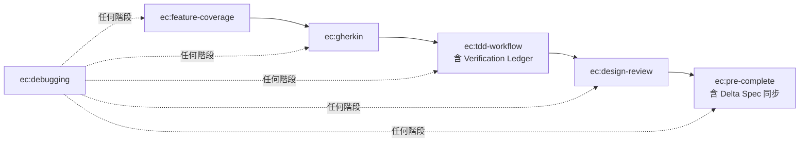

# spec-to-quality — Agent Guide

這套 skills 實現「從規格到品質」的 Python TDD 開發流程。

## Skill 執行順序

## 規則

- **不可跳步**：每個 skill 有前置條件，必須滿足才能進入下一個
- **一個 spec 完整走完再做下一個**：不要一次規劃所有功能的 OpenSpec，而是一個 spec 從 coverage → gherkin → TDD → review → complete 全部走完後，再開始下一個 spec。避免 agent 誤以為要先寫完所有 spec 才能開始實作
- **測試/lint/type check 命令**：一律參照專案 CLAUDE.md 的 Commands 區段，不要假設任何特定工具
- **等待使用者確認**：ec:feature-coverage 分析完、ec:tdd-workflow Verification Ledger 確認、紅燈確認，都需要使用者明確同意才能繼續
- **ec:debugging 可在任何階段觸發**：遇到 bug 或測試失敗時，暫停當前流程進入 ec:debugging
- **Gherkin 關鍵字英文、內容中文**：Feature/Scenario/Given/When/Then 等關鍵字一律英文，步驟描述與名稱使用繁體中文
- **分支策略**：開始實作前，應詢問使用者是否要開新分支（遵循專案的分支命名規範）。如果有其他 agent 同時工作，考慮使用 worktree 隔離。不要直接在 main 分支上開發功能

## Skill 銜接說明

| 從 | 到 | 銜接方式 |
|----|-----|---------|
| ec:feature-coverage | ec:gherkin | 覆蓋率分析確認後，直接觸發 ec:gherkin skill 撰寫 .feature |
| ec:gherkin | ec:tdd-workflow | .feature 撰寫完成後，先做 Verification Ledger（Mock 邊界審查），確認後再進入 Red |
| ec:tdd-workflow | ec:design-review | 綠燈 + refactor 完成後，提醒可以觸發 ec:design-review |
| ec:design-review | ec:pre-complete | review 完成後，如果要 commit/PR，觸發 ec:pre-complete（含 delta spec 同步） |
| 任何階段 | ec:debugging | 測試失敗或遇到 bug 時自動觸發 |

## 與 discovery 的銜接

如果專案有使用 `discovery` plugin，在開始 ec:feature-coverage 之前確認以下文件存在：

- **goals.md** — ec:feature-coverage 用來確保 scenario 覆蓋所有 goals（Gx traceability）
- **dominant-ops.md** — ec:tdd-workflow 的 Verification Ledger 用 anti-patterns 校準 mock 邊界
- **SYSTEM_MAP.md** — Change Protocol 指導每個 change 的影響範圍判斷

如果這些文件不存在，提醒使用者先完成 discovery 流程（或確認不需要 discovery）。

## 前置要求

此 plugin 假設專案的 CLAUDE.md 包含以下區段：

- **Commands**：定義測試、lint、format、type check 的具體命令
- **Feature Scenario 具體化對應表**（選用）：將 6 類通用 scenario 類別對應到專案特定概念

## 新專案提醒

如果專案使用 OpenSpec 但尚未初始化，在開始任何 spec 工作前提醒使用者執行 `openspec init`。判斷方式：專案中不存在 `openspec/` 目錄。
